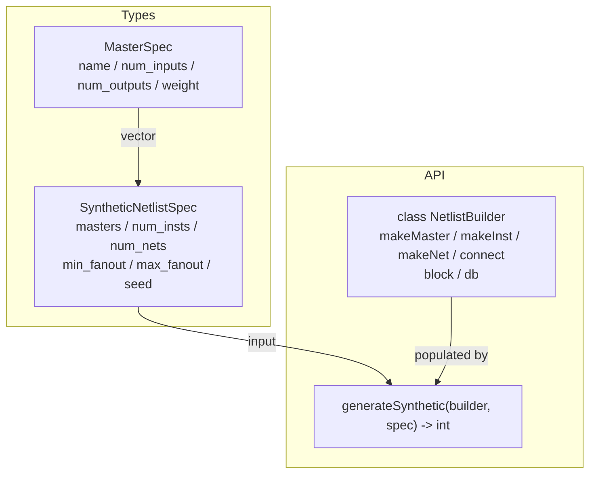
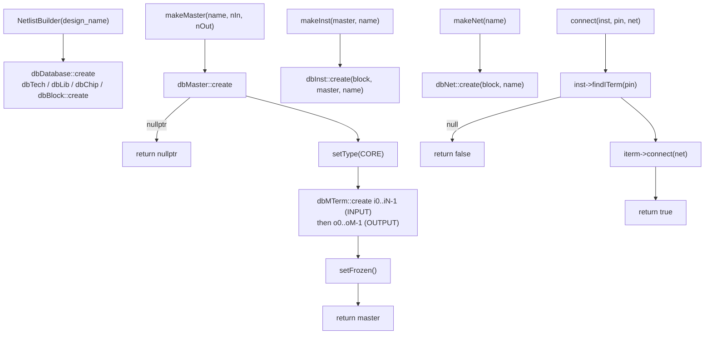
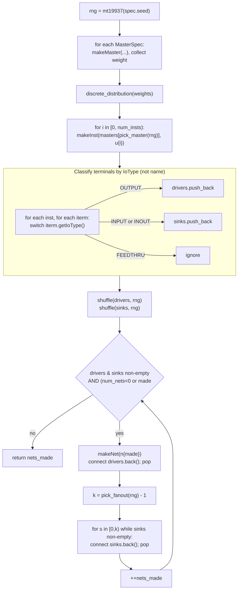
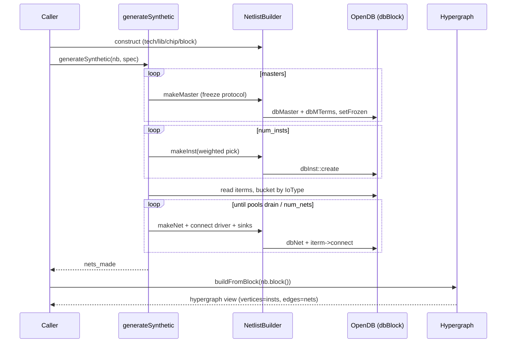

# Flow: netlistgen Engine

The netlistgen engine (`src/engines/netlistgen/`) constructs `dbBlock`
netlists directly through the OpenDB API — no LEF/DEF — for use as
Stage 1/2 test/benchmark fixtures. It has two pieces in one translation
unit (`netlistgen.h` / `netlistgen.cpp`): `NetlistBuilder`, a thin owner of
a fresh `dbDatabase` that wraps the create/connect calls, and the free
function `generateSynthetic()`, which fills a builder's block from a
`SyntheticNetlistSpec`. This document reflects the code as of Stage A (the
IoType-based pin refactor); LEF-backed masters, statistical mixes, loop
avoidance, and writers arrive in Stages B–E.

## `netlistgen.h` — API surface

Declares the two layers plus the two spec structs. No logic lives in the
header.

## `netlistgen.cpp` — `NetlistBuilder`

Owns the `dbDatabase` lifetime and enforces OpenDB's create ordering. The
key constraint is the **master-freeze protocol**: every `dbMTerm` must be
created before `setFrozen()`, and a master must be frozen before any
`dbInst::create`. `makeMaster` creates `INPUT` pins `i0..iN-1` then `OUTPUT`
pins `o0..oM-1` and freezes; `connect` resolves a pin by name via
`findITerm` (a builder convenience used by hand-built tests, not by the
generator).

## `netlistgen.cpp` — `generateSynthetic()`

The generator seeds one `std::mt19937(spec.seed)`, materializes masters and
instances, then forms nets from two shuffled pin pools. The pin
classification is the Stage A refactor: each `dbITerm` is bucketed by
`getIoType()` — **never by pin name** — so LEF-backed masters (Stage B) work
without touching this code. Every iterm is popped from a pool at most once,
so the netlist is always valid (each pin on ≤ 1 net).

## Engine-level flow: spec → block → hypergraph

End to end, netlistgen turns a declarative spec into a `dbBlock` that the
downstream `Hypergraph` consumes. netlistgen writes no attribute planes;
the hypergraph and later engines (e.g. partitioning) layer planes on top.

