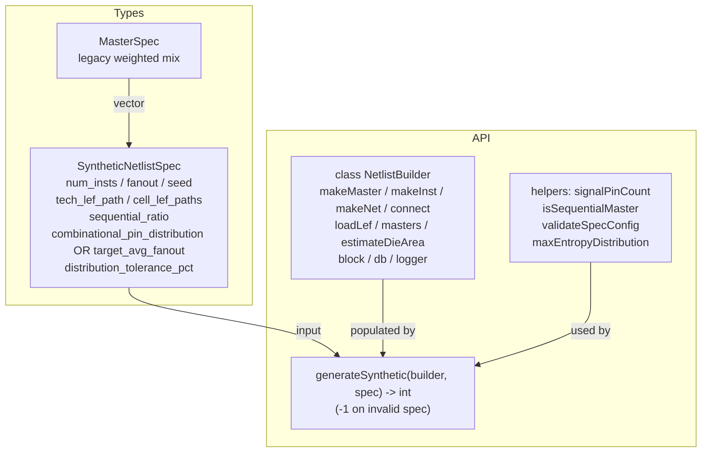
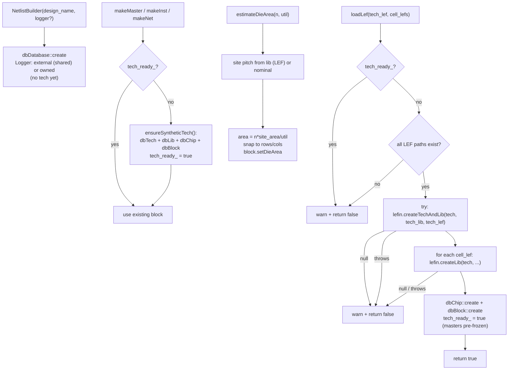
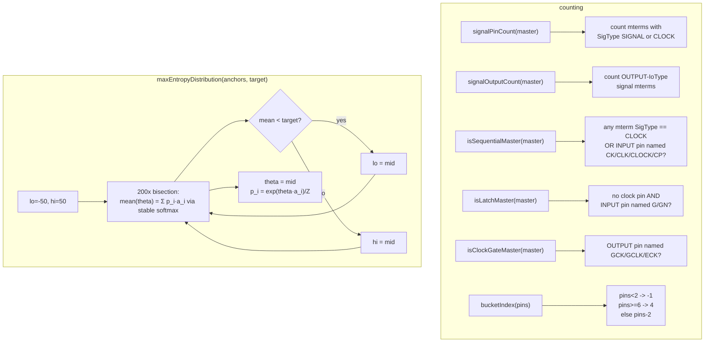
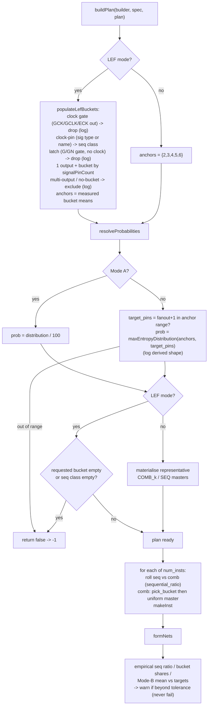
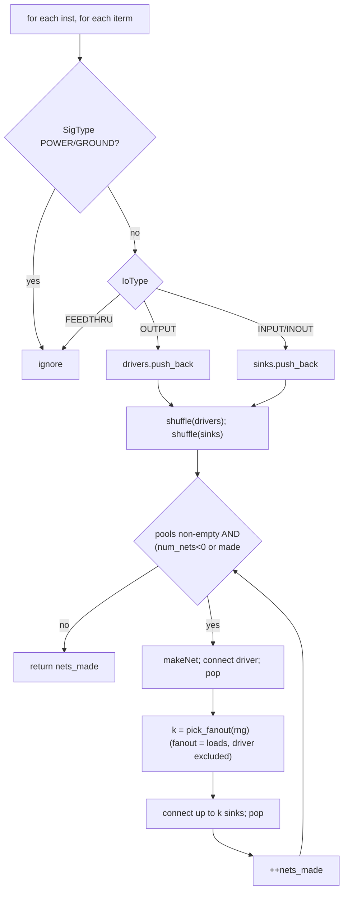
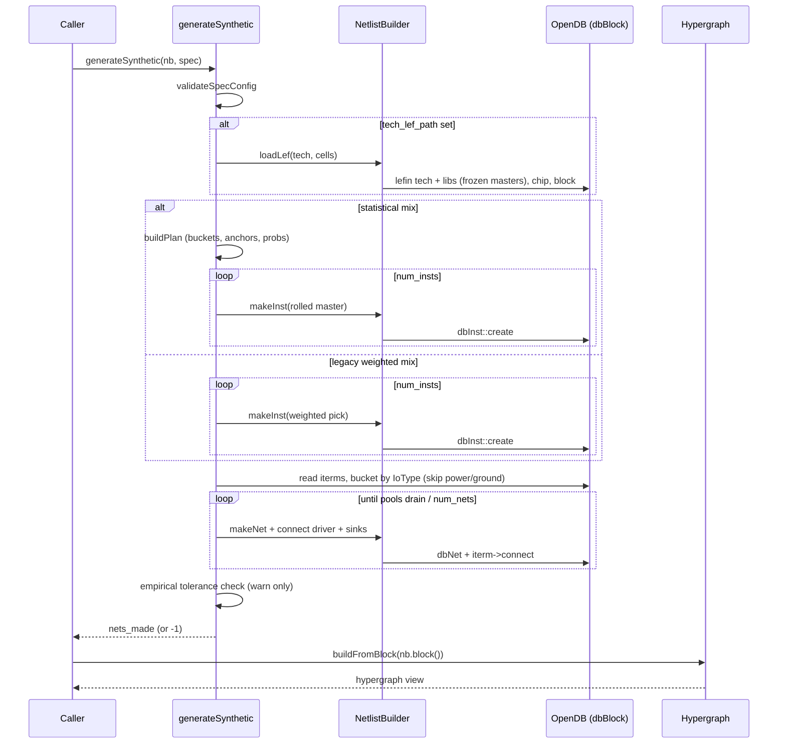
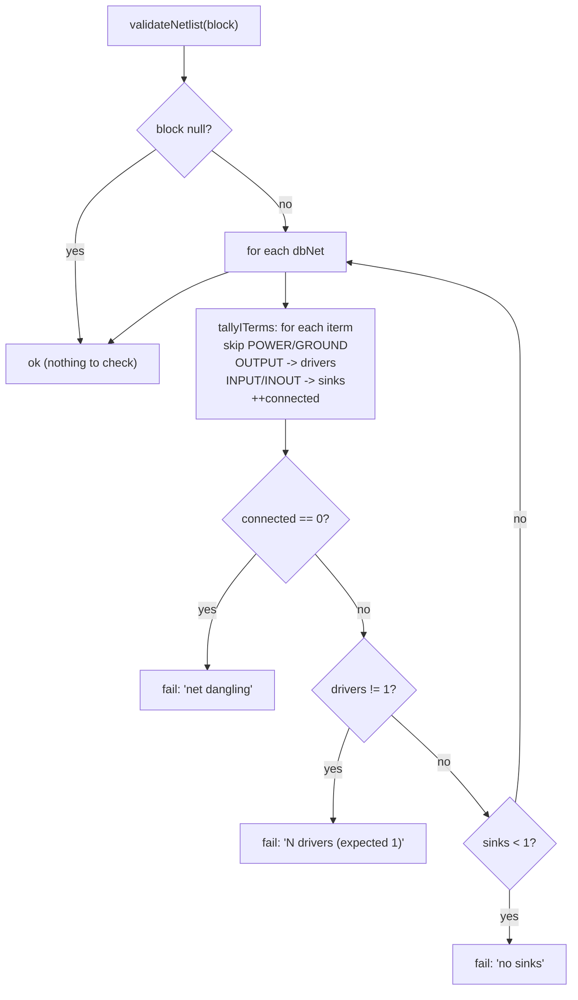
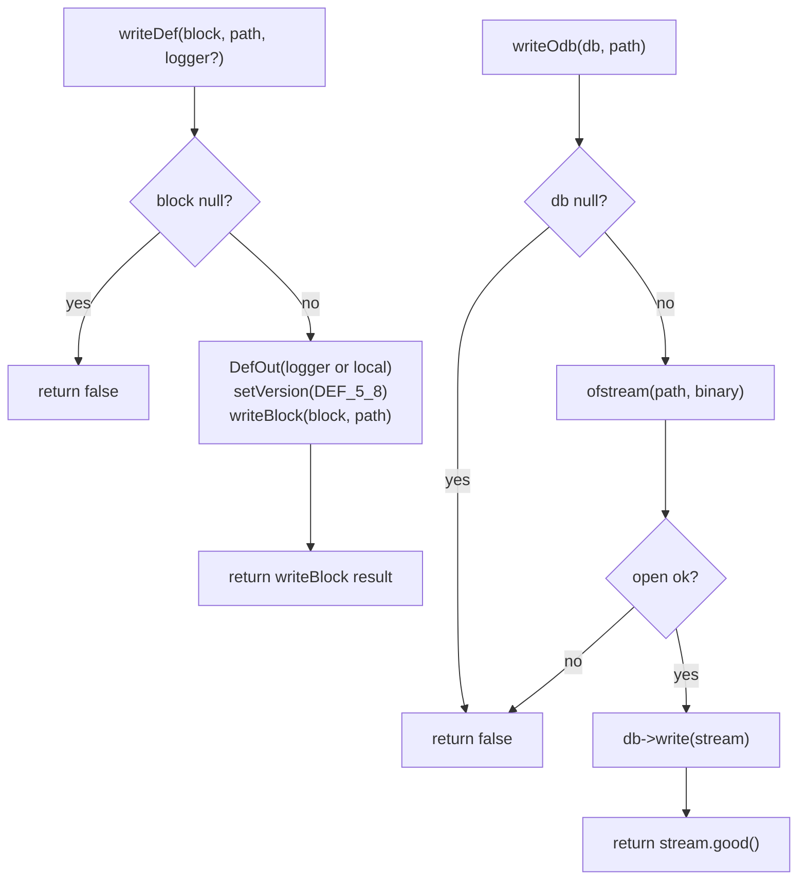
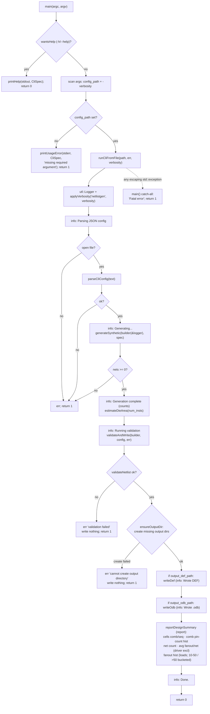
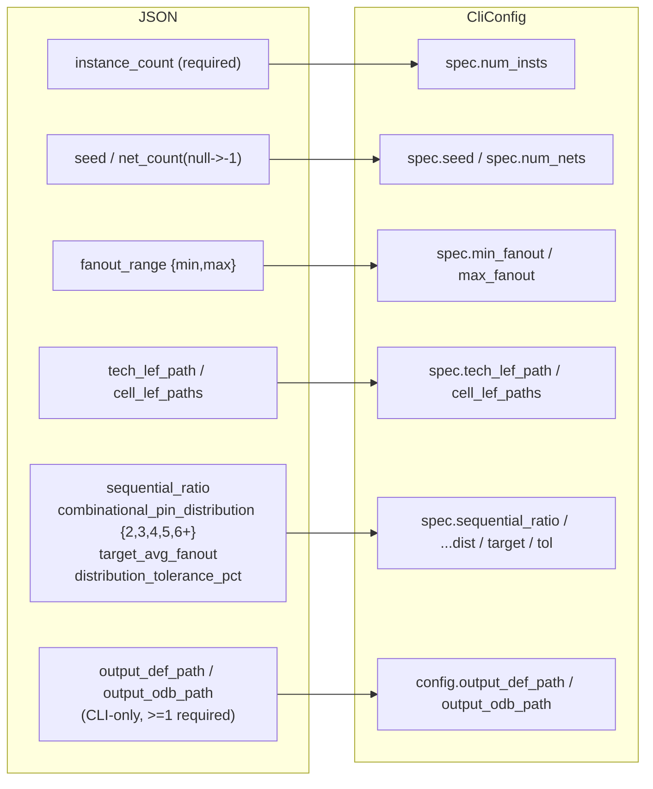

# Flow: netlistgen Engine

The netlistgen engine (`src/engines/netlistgen/`) constructs `dbBlock`
netlists through the OpenDB API — synthetically or backed by real LEF cells —
for use as test/benchmark fixtures. Core pieces: `NetlistBuilder`, owner of a
fresh `dbDatabase` that wraps create/connect and LEF loading, and the free
function `generateSynthetic()`, which fills a builder's block from a
`SyntheticNetlistSpec` (`netlistgen.h` / `netlistgen.cpp`). Stage C adds output
and a driver: the DEF / `.odb` writers (`netlist_writers.h/.cpp`), the net
well-formedness check (`netlist_validation.h/.cpp`), and a standalone
JSON-driven CLI (`cli_config.h/.cpp`, `netlistgen_cli.cpp`). This reflects the
code as of Stage C (LEF-backed generation + statistical cell mix + max-entropy
solve + writers + validation + CLI).

**Loop-avoidance caveat.** Combinational-loop avoidance is **Stage D** (not yet
landed): net formation still pairs drivers/sinks from shuffled pools, so
generated blocks — and any DEF/`.odb` the CLI writes — are structurally
well-formed but **may contain combinational loops**. Treat them as
preview/manual-inspection artifacts, not yet valid downstream fixtures.
Primary I/O ports and a Verilog writer are **Stage E**.

## `netlistgen.h` — API surface

Declares the two layers, the spec structs, and the shared statistical-mix
helpers (`signalPinCount`, `isSequentialMaster`, `validateSpecConfig`,
`maxEntropyDistribution`). No logic in the header.

## `netlistgen.cpp` — `NetlistBuilder`

Owns the `dbDatabase` lifetime and the two tech-setup paths. Synthetic
tech/lib/chip/block is created lazily by `ensureSyntheticTech()` on first
`makeMaster`/`makeInst`/`makeNet` (preserving Stage A's direct-use tests).
`loadLef()` takes the LEF path instead: it first prechecks each LEF path
with `std::filesystem::exists` (a missing file becomes `warn + return false`
rather than a thrown-and-crashing `lefin` error), then, inside a boundary
`try/catch`, `lefin::createTechAndLib` builds the tech (3-arg call),
`createLib` adds each cell LEF, and chip+block are created. The
`try/catch` contains a present-but-malformed LEF: OpenROAD's
`createTechAndLib` calls `logger->error()`, which throws, and catching it
here (close to the call) keeps it a `return false` instead of a segfault —
a catch further up in the CLI's `main()` does not work (see "Error
handling" in `CLAUDE.md`). LEF masters arrive already frozen from `lefin`;
synthetic masters are frozen explicitly. A builder is one path or the
other (`tech_ready_`).

## `netlistgen.cpp` — signal-pin counting & max-entropy solve

Shared helpers. `signalPinCount` and `signalOutputCount` count only
`SIGNAL`/`CLOCK` mterms, excluding `POWER`/`GROUND`. `isSequentialMaster` flags
a master as sequential if it has a clock pin — a `CLOCK` sig type, or (fallback
for libraries like Nangate45 that tag the clock pin `USE SIGNAL`) an input pin
whose name matches `isClockPinName` (`CK`/`CLK`/`CLOCK`/`CP`). `isLatchMaster`
flags a non-clocked master with a level-sensitive gate/enable pin
(`isLatchEnablePinName` = `G`/`GN`) — a latch, dropped entirely.
`isClockGateMaster` flags a master driving a gated-clock output
(`isGatedClockPinName` = `GCK`/`GCLK`/`ECK`) — a clock gate, also dropped even
though it has a clock pin. `bucketIndex` maps a signal-pin count to bucket 0..4.
`maxEntropyDistribution` bisects a single `theta` so the tilted distribution's
mean hits the target.

## `netlistgen.cpp` — `generateSynthetic()` dispatch

`validateSpecConfig` runs first (config-only checks). If a LEF path is set,
`loadLef` runs before any instance. Then the spec selects the legacy or
statistical path; both end in the shared `formNets`.

## `netlistgen.cpp` — statistical generation

`buildPlan` resolves the per-bucket master lists, anchors, and probabilities,
validating LEF buckets. `generateStatistical` then rolls each instance and
finishes with `formNets` and the post-generation tolerance check.

## `netlistgen.cpp` — `formNets()` (shared)

Both regimes end here. Terminals are bucketed into driver/sink pools by
IoType, with power/ground excluded by `dbSigType`. Each net gets one driver
plus `fanout` sinks, where `fanout` is the load count (driver excluded). Every
iterm is popped at most once, so the netlist is valid (each pin on ≤ 1 net) —
**though not yet acyclic; Stage D adds that**.

## Engine-level flow: spec → block → hypergraph

End to end, netlistgen turns a declarative spec into a `dbBlock` (synthetic or
LEF-backed) that the downstream `Hypergraph` consumes. netlistgen writes no
attribute planes.

## `netlist_validation.cpp` — well-formedness check (Stage C)

`validateNetlist(block)` walks every `dbNet` and tallies its connected
`dbITerm`s by IoType (power/ground skipped by `dbSigType`) via `tallyITerms`,
returning on the first net that breaks a structural invariant. This is a
distinct guarantee from Stage D's loop-freedom: a net can be perfectly
well-formed and still sit on a combinational cycle. The tally struct is
factored so Stage E can fold primary-input/-output `dbBTerm`s into the same
driver/sink totals before the verdict.

## `netlist_writers.cpp` — DEF / `.odb` output (Stage C)

Two thin wrappers, callable independently of the CLI. `writeDef` drives
`odb::DefOut` at version 5.8 (no PINS section — no primary ports until Stage E);
it supplies a local `utl::Logger` when the caller passes none. `writeOdb` wraps
`dbDatabase::write`, which takes a `std::ostream`, in a checked `ofstream`.
(Synthetic-tech DBUs are set to 2000/µm in `ensureSyntheticTech` so DefOut's
def-units ÷ dbu-per-micron scaling is well-defined; LEF mode inherits real
units from the tech LEF.)

## `cli_config.cpp` / `netlistgen_cli.cpp` — the CLI (Stage C)

JSON is confined to the CLI layer — it never reaches `NetlistBuilder` /
`generateSynthetic`. `parseCliConfig` deserialises the JSON into a
`SyntheticNetlistSpec` plus CLI-only output paths, enforcing CLI-level rules
(well-formed JSON, required `instance_count`, ≥1 output path); spec-level rules
stay with `validateSpecConfig` at generation time. `runCliFromFile` is the one
pipeline: create a shared `utl::Logger` (verbosity from the `-verbosity` flag
via `applyVerbosity`) → parse → `generateSynthetic` (builder shares the logger)
→ `estimateDieArea` → `validateAndWrite` → `reportDesignSummary` (final
default-visible statistics block: cell counts comb/seq, combinational
pin-count histogram, net count, average fanout per net and a fanout histogram —
fanout meaning load pins, driver excluded, with `10-50`/`>50` bucketed) →
log done. Each step is an
`info` phase marker; `-verbosity` surfaces the library's `debugPrint` detail through
the same logger. `validateAndWrite` gates output on `validateNetlist` (a
malformed block writes **nothing**, fail-fast) and then creates each requested
output path's parent directory (with `create_directories`) if it is missing,
before writing; only a directory that genuinely cannot be created fails, with
no partial output. `main()` in `netlistgen_cli.cpp`
parses the positional config path and the optional `-verbosity <level>` flag,
then calls `runCliFromFile` inside a top-level `try/catch` backstop (see
"Error handling" in `CLAUDE.md`).

### CLI parse mapping

