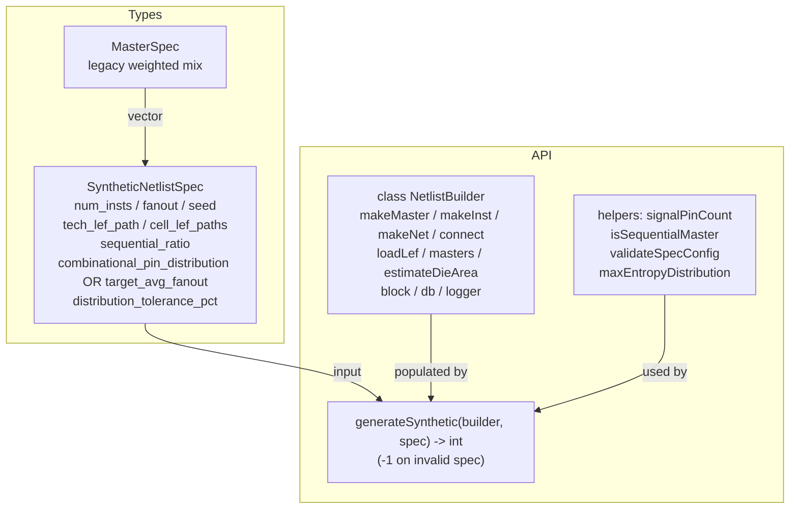
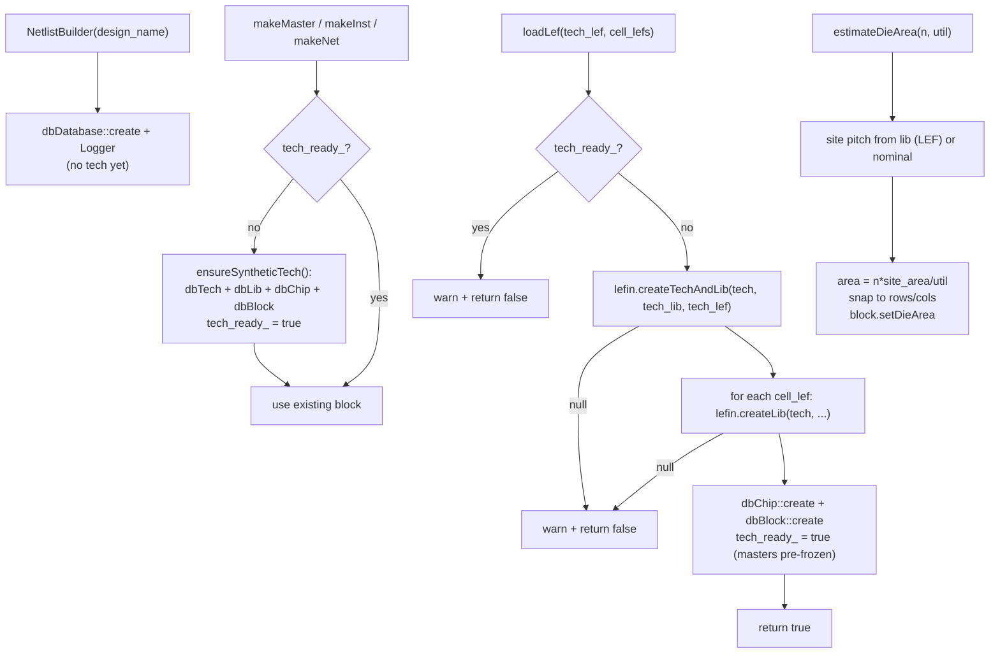
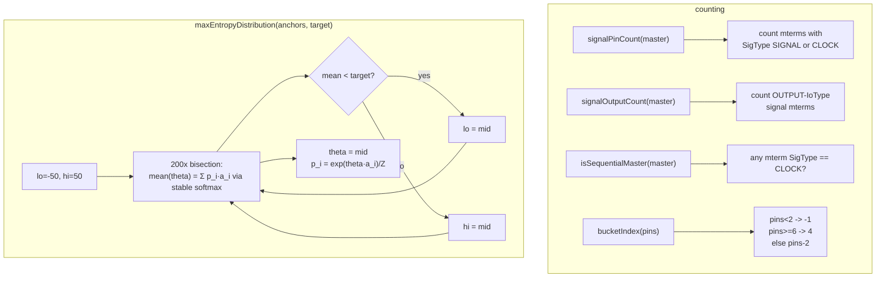
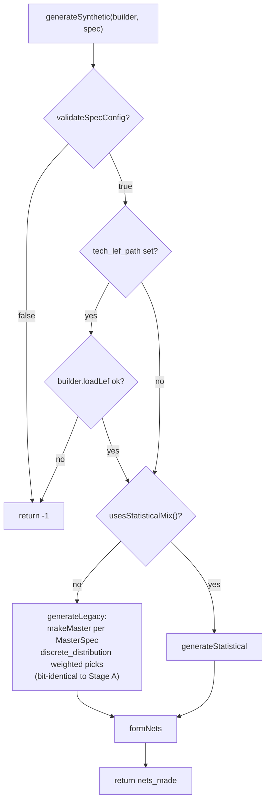
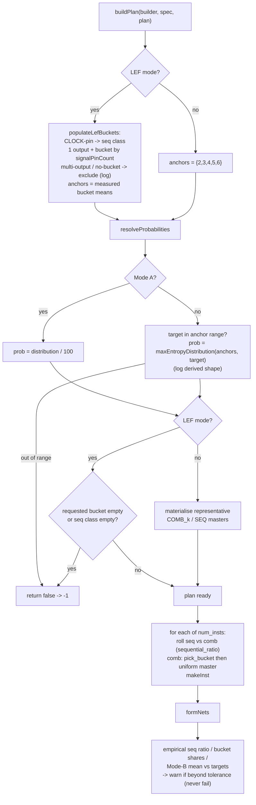
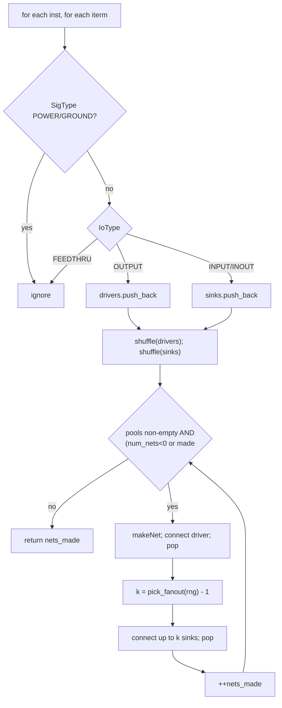
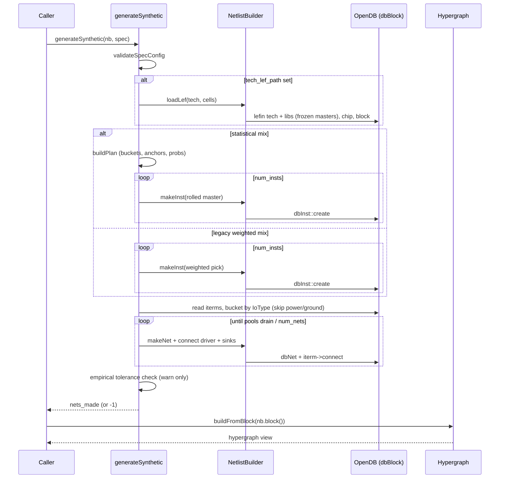

# Flow: netlistgen Engine

The netlistgen engine (`src/engines/netlistgen/`) constructs `dbBlock`
netlists through the OpenDB API — synthetically or backed by real LEF cells —
for use as test/benchmark fixtures. Two pieces in one translation unit
(`netlistgen.h` / `netlistgen.cpp`): `NetlistBuilder`, owner of a fresh
`dbDatabase` that wraps create/connect and LEF loading, and the free function
`generateSynthetic()`, which fills a builder's block from a
`SyntheticNetlistSpec`. This reflects the code as of Stage B (LEF-backed
generation + statistical cell mix + max-entropy solve). Loop-free net
formation and writers arrive in Stages C–E.

## `netlistgen.h` — API surface

Declares the two layers, the spec structs, and the shared statistical-mix
helpers (`signalPinCount`, `isSequentialMaster`, `validateSpecConfig`,
`maxEntropyDistribution`). No logic in the header.

## `netlistgen.cpp` — `NetlistBuilder`

Owns the `dbDatabase` lifetime and the two tech-setup paths. Synthetic
tech/lib/chip/block is created lazily by `ensureSyntheticTech()` on first
`makeMaster`/`makeInst`/`makeNet` (preserving Stage A's direct-use tests).
`loadLef()` takes the LEF path instead: `lefin::createTechAndLib` builds the
tech (3-arg call), `createLib` adds each cell LEF, then chip+block are
created. LEF masters arrive already frozen from `lefin`; synthetic masters
are frozen explicitly. A builder is one path or the other (`tech_ready_`).

## `netlistgen.cpp` — signal-pin counting & max-entropy solve

Shared helpers. `signalPinCount` and `signalOutputCount` count only
`SIGNAL`/`CLOCK` mterms, excluding `POWER`/`GROUND`. `bucketIndex` maps a
signal-pin count to bucket 0..4. `maxEntropyDistribution` bisects a single
`theta` so the tilted distribution's mean hits the target.

## `netlistgen.cpp` — `generateSynthetic()` dispatch

`validateSpecConfig` runs first (config-only checks). If a LEF path is set,
`loadLef` runs before any instance. Then the spec selects the legacy or
statistical path; both end in the shared `formNets`.

## `netlistgen.cpp` — statistical generation

`buildPlan` resolves the per-bucket master lists, anchors, and probabilities,
validating LEF buckets. `generateStatistical` then rolls each instance and
finishes with `formNets` and the post-generation tolerance check.

## `netlistgen.cpp` — `formNets()` (shared)

Both regimes end here. Terminals are bucketed into driver/sink pools by
IoType, with power/ground excluded by `dbSigType` — for synthetic masters
(no power pins) this is identical to Stage A, keeping legacy output
bit-identical. Every iterm is popped at most once, so the netlist is valid
(each pin on ≤ 1 net) — **though not yet acyclic; Stage C adds that**.

## Engine-level flow: spec → block → hypergraph

End to end, netlistgen turns a declarative spec into a `dbBlock` (synthetic or
LEF-backed) that the downstream `Hypergraph` consumes. netlistgen writes no
attribute planes.

