# Flow: netlistgen Engine

The netlistgen engine (`src/engines/netlistgen/`) constructs `dbBlock`
netlists through the OpenDB API — synthetically or backed by real LEF cells —
for use as test/benchmark fixtures. Core pieces: `NetlistBuilder`, owner of a
fresh `dbDatabase` that wraps create/connect and LEF loading, and the free
function `generateSynthetic()`, which fills a builder's block from a
`SyntheticNetlistSpec` (`netlistgen.h` / `netlistgen.cpp`). Stage C adds output
and a driver: the DEF / `.odb` writers (`netlist_writers.h/.cpp`), the net
well-formedness check (`netlist_validation.h/.cpp`), and a standalone
JSON-driven CLI (`cli_config.h/.cpp`, `netlistgen_cli.cpp`). This reflects the
code as of Stage E1 (LEF-backed generation + statistical cell mix +
max-entropy solve + writers + validation + CLI + acyclic net formation + peak
fanout sub-clusters + primary I/O generation via Rent's rule).

**Combinational-loop freedom (Stage D).** Statistical-mix net formation is
**acyclic by construction**: `formNetsAcyclic` reuses the instance creation
index as a topological order and filters receiver eligibility so every
comb→comb edge goes strictly forward (see its section below). This requires
`sequential_ratio > 0` (fail-fast in `validateSpecConfig`) — sequential Q
outputs bootstrap the combinational DAG; **this is unaffected by Stage E1**
(below) since primary I/O ports run as a separate pass after formation
completes, never participating in the DAG bootstrap. The legacy weighted mix
keeps the original shuffled-pool `formNets` and makes no acyclicity
guarantee.

**Peak fanout sub-clusters** (optional, layered on Stage D — see its own
section below): `assignPeakClusters` groups a subset of instances into
`num_peak_clusters` clusters once per generation; `formNetsAcyclic`'s net
formation then biases receiver selection toward the driver's own cluster
for a fixed fraction of sink slots, but **only ever within the pools Stage D
already treats as eligible** — so cluster preference can bias *which*
eligible receiver is picked, never make an ineligible one eligible, and the
DAG/loop-freedom guarantee above is completely unaffected.

**Primary I/O generation via Rent's rule (Stage E1)**, `applyPrimaryIoStageE1`
— a separate pass over the already-formed `dbBlock`, run once
`formNetsAcyclic` returns (see its own section below). Sizes a target PI/PO
terminal count from `T = k·Gᵖ`, randomly samples that many nets to become
boundary-visible, and inserts combinational/buffered/registered pin types.
The one hard invariant this pass must preserve — "exactly one driver per
net" (`validateNetlist`, now `dbBTerm`-aware) — is why a PI **replaces**
its selected net's existing driver rather than being added "alongside" it
(see the section below for the full rationale); a PO has no such conflict
(one more sink/observer on an already-driven net is always fine). Reuses
Stage E1's already-assigned `cluster_id` (if peak fanout sub-clusters are
also engaged) for per-cluster + background Rent statistics. `netlistgen`
never touches the `Hypergraph` engine (unchanged since Stage A) — Stage E1
returns raw `dbNet*`/`dbInst*` lists via `RentStats` instead of hypergraph
planes; see its section below.

## `netlistgen.h` — API surface

Declares the two layers, the spec structs, and the shared statistical-mix
helpers (`signalPinCount`, `isSequentialMaster`, `validateSpecConfig`,
`maxEntropyDistribution`, `assignPeakClusters`). No logic in the header.

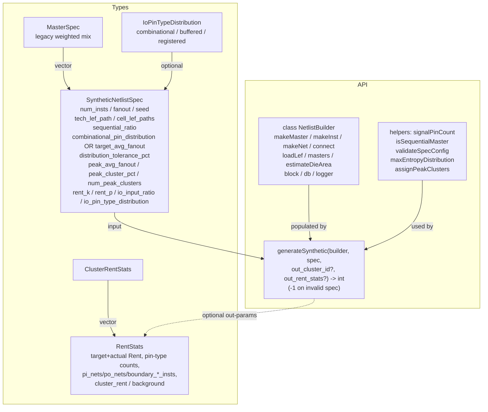

## `netlistgen.cpp` — `NetlistBuilder`

Owns the `dbDatabase` lifetime and the two tech-setup paths. Synthetic
tech/lib/chip/block is created lazily by `ensureSyntheticTech()` on first
`makeMaster`/`makeInst`/`makeNet` (preserving Stage A's direct-use tests).
`loadLef()` takes the LEF path instead: it first prechecks each LEF path
with `std::filesystem::exists` (a missing file becomes `warn + return false`
rather than a thrown-and-crashing `lefin` error), then, inside a boundary
`try/catch`, `lefin::createTechAndLib` builds the tech (3-arg call),
`createLib` adds each cell LEF, and chip+block are created. The
`try/catch` contains a present-but-malformed LEF: OpenROAD's
`createTechAndLib` calls `logger->error()`, which throws, and catching it
here (close to the call) keeps it a `return false` instead of a segfault —
a catch further up in the CLI's `main()` does not work (see "Error
handling" in `CLAUDE.md`). LEF masters arrive already frozen from `lefin`;
synthetic masters are frozen explicitly. A builder is one path or the
other (`tech_ready_`).

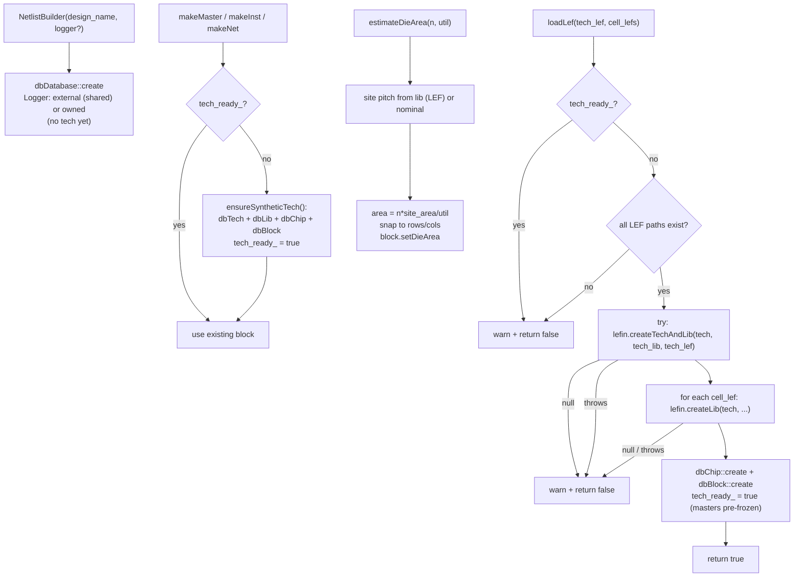

## `netlistgen.cpp` — signal-pin counting & max-entropy solve

Shared helpers. `signalPinCount` and `signalOutputCount` count only
`SIGNAL`/`CLOCK` mterms, excluding `POWER`/`GROUND`. `isSequentialMaster` flags
a master as sequential if it has a clock pin — a `CLOCK` sig type, or (fallback
for libraries like Nangate45 that tag the clock pin `USE SIGNAL`) an input pin
whose name matches `isClockPinName` (`CK`/`CLK`/`CLOCK`/`CP`). `isLatchMaster`
flags a non-clocked master with a level-sensitive gate/enable pin
(`isLatchEnablePinName` = `G`/`GN`) — a latch, dropped entirely.
`isClockGateMaster` flags a master driving a gated-clock output
(`isGatedClockPinName` = `GCK`/`GCLK`/`ECK`) — a clock gate, also dropped even
though it has a clock pin. `bucketIndex` maps a signal-pin count to bucket 0..4.
`maxEntropyDistribution` bisects a single `theta` so the tilted distribution's
mean hits the target.

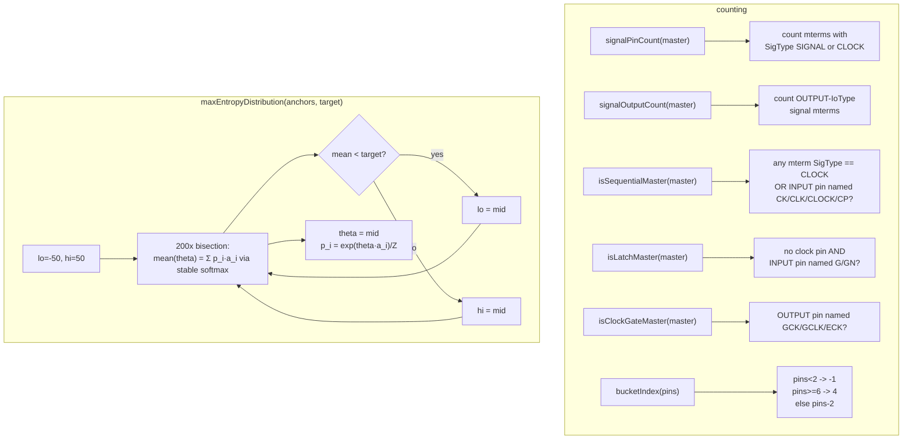

## `netlistgen.cpp` — `generateSynthetic()` dispatch

`validateSpecConfig` runs first (config-only checks). If a LEF path is set,
`loadLef` runs before any instance. Then the spec selects the legacy path
(ending in the shuffled-pool `formNets`) or the statistical path (ending in
the Stage D ordered `formNetsAcyclic`).

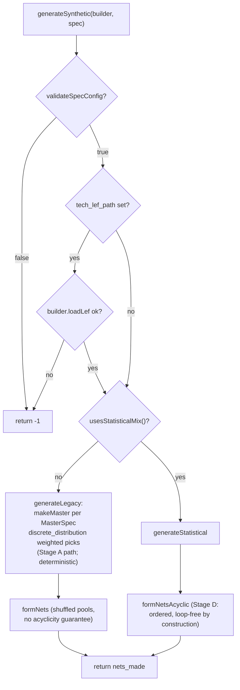

Note `validateSpecConfig` (run first) also enforces the Stage D
bootstrap-source rule: a statistical spec with `sequential_ratio <= 0`
(unset counts as 0) fails fast — sequential Q outputs are the only signal
source that can start the combinational DAG until Stage E's primary inputs.

## `netlistgen.cpp` — statistical generation

`buildPlan` resolves the per-bucket master lists, anchors, and probabilities,
validating LEF buckets. `generateStatistical` then rolls each instance and
finishes with `formNetsAcyclic` (Stage D), the post-generation tolerance
check, and — if `rent_k`/`rent_p` are set — `applyPrimaryIoStageE1`
(Stage E1).

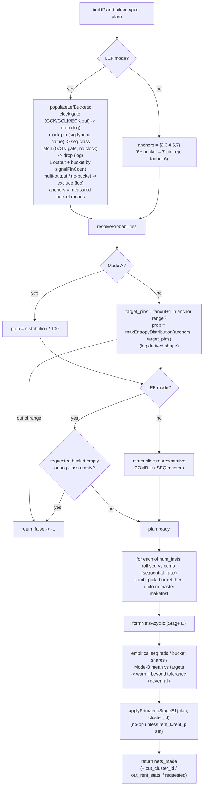

The cell mix is decided entirely before net formation, so Stage D's ordered
formation cannot disturb the empirical proportions the tolerance check
measures; Stage E1 runs even later still (after that check), so it cannot
disturb them either.

## `netlistgen.cpp` — `formNets()` (legacy path only)

The legacy weighted mix ends here. Terminals are bucketed into driver/sink
pools by IoType, with power/ground excluded by `dbSigType`. Each net gets one
driver plus `fanout` sinks, where `fanout` is the load count (driver
excluded). Every iterm is popped at most once, so the netlist is valid (each
pin on ≤ 1 net) — but the pairing is unconstrained, so **this path makes no
acyclicity guarantee** (it predates Stage D and supports multi-output
masters with no sequential/combinational classification).

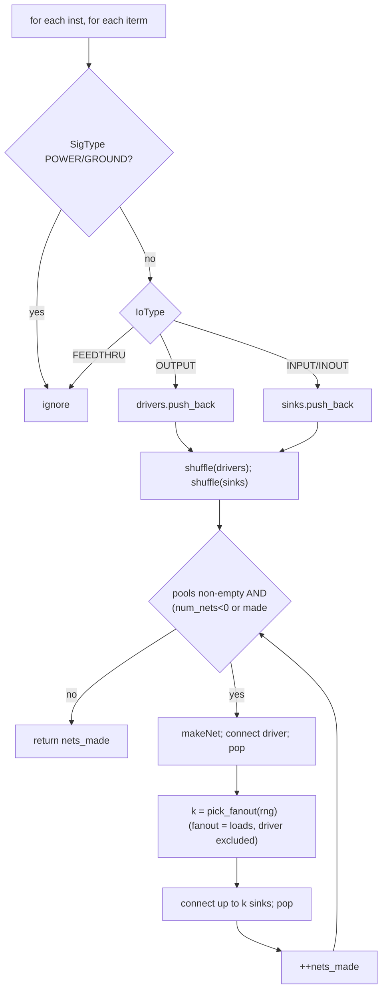

## `netlistgen.cpp` — `formNetsAcyclic()` (Stage D, statistical path)

The statistical mix ends here instead. Instance creation order (`u0..u{n-1}`)
doubles as a topological order over the combinational cells; drivers are
processed in that same order and receiver *eligibility* is filtered while the
receiver *count* stays governed by `[min_fanout, max_fanout]`. Three receiver
pools carry the eligibility state:

- `seq_pool` — unused sequential-instance inputs (D/CK). Eligible for
  **every** driver: register inputs accept any source (feedback through a
  register is sequential, not combinational).
- `comb_active` — unused combinational inputs whose owner instance has **not
  been processed yet** (index > current `i`). Eligible for every driver.
- `comb_retired` — unused combinational inputs whose owner **has** been
  processed (index ≤ `i`). Eligible for **sequential (Q) drivers only**: a
  combinational driver may never feed an earlier-or-own instance.

At step `i` the instance's own unused inputs are retired *before* its net is
formed (so it can never drive itself), then each of its output pins draws
receivers uniformly from the union of its eligible pools (swap-remove
sampling; `active_pos` keeps `comb_active` O(1) under removal). Every
comb→comb edge therefore satisfies `driver index < receiver index` — a DAG by
construction. Thin-pool behavior is deterministic and documented in
README.md: a net whose eligible pool cannot cover `min_fanout` is loosened
(≥ 1 receiver, counted + debug-logged); a driver with zero eligible
receivers is skipped entirely in THIS pass (no net — never a sinkless net,
never a stall) — `has_connection[i]` records whether *any* output pin of
instance `i` got a net here, feeding the repair pass below.

If `spec.peak_avg_fanout` is set, `assignPeakClusters` runs once up front
(see its own diagram below) and the per-net logic gains one more branch —
covered separately below so this diagram stays the un-clustered baseline.

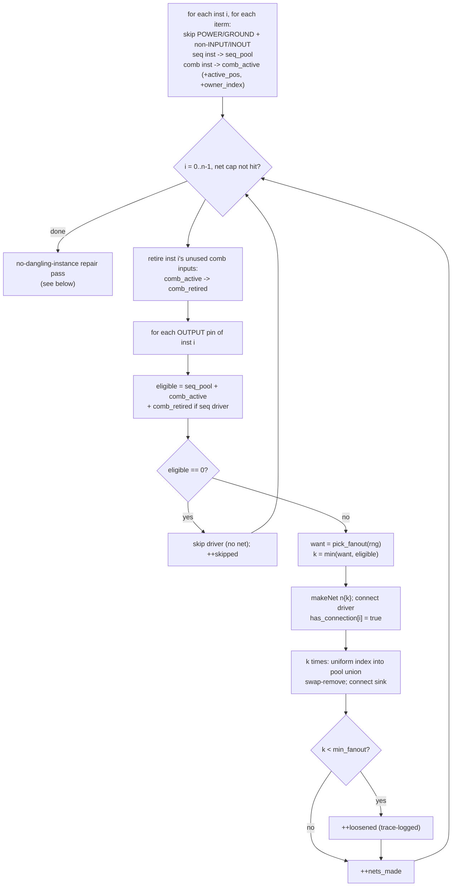

### No-dangling-instance repair pass

Runs once the loop above finishes, before `formNetsAcyclic` returns. See
README.md's "Guaranteed instance connectivity" section for the full
rationale (including a discarded earlier design — an up-front per-instance
reservation — and the measurement that ruled it out: it dragged a
peak-cluster design's achieved fanout down to roughly half its target by
permanently shrinking the general sampling pool for every instance, not
just the ones actually at risk).

Two data structures make the repair itself efficient at the instance counts
this engine targets (an O(n) scan per repaired instance, times up to n
repairs, would be O(n²)):

- `comb_by_owner` — every remaining `comb_active`/`comb_retired` iterm,
  keyed by owner instance index in a `std::set`. "Does a combinational input
  at index `> i` still exist" is then a single lookup at the set's maximum.
- `net_sink_count` + `comb_stealable`/`seq_stealable` — a one-time,
  O(total pins) scan builds a live per-net sink count and two candidate
  lists (owner-sorted comb / plain-list sequential) of every currently
  *connected* input pin, for the stealing fallback. Candidates are
  validated lazily at pop time against `net_sink_count` (which only ever
  decreases) — a stale candidate (its donor net already stolen down to one
  sink) is discarded permanently, never rescanned.

The outer scan runs `i = n-1` down to `0` — **reverse** creation order — so
the most constrained instance (the very last one, which has zero
higher-index candidates and so depends on `seq_pool` alone) gets first pick
of the shared, universally-usable `seq_pool` before earlier, less
constrained dangling drivers are even considered.

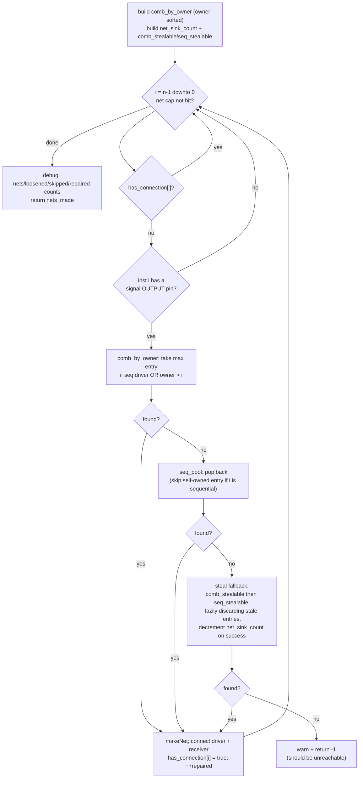

## `netlistgen.cpp` — peak fanout sub-clusters (optional, layered on Stage D)

`assignPeakClusters` (exposed for testing) runs once, at the very top of
`formNetsAcyclic`, only if `spec.peak_avg_fanout` is set — it consumes the
shared `rng` exactly once (a single shuffle), so it does not perturb
generation determinism when the feature is unused. Its result is pure
bookkeeping (`cluster_id`, index-aligned with creation order): never
attached to the `dbBlock`/`Hypergraph`, only optionally copied out through
`generateSynthetic`'s `out_cluster_id` parameter for tests.

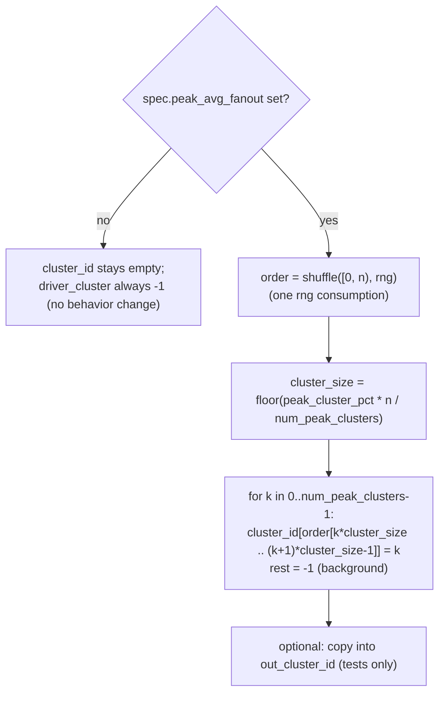

When a driver's instance has `cluster_id[i] >= 0`, `formNetsAcyclic`'s per-net
logic (from the baseline diagram above) gains this extra branch in place of
the plain "want = pick_fanout(rng)" / "uniform index into pool union" steps:

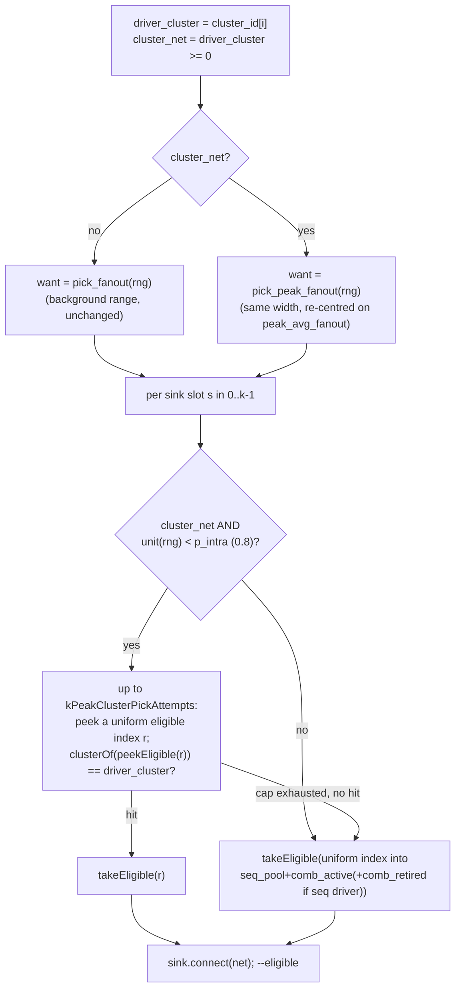

Rejection sampling never mutates pool state on a miss (`peekEligible` reads
without removing), so a failed cluster-preferred attempt costs one extra
`rng` draw and nothing else; the eventual accepted pick (cluster-hit or
background fallback) is the only one that calls `takeEligible` and removes
from the pool. This is why cluster preference can never violate Stage D's
DAG invariant: it only ever chooses **among** the pools `formNetsAcyclic`
already computed as eligible for this specific driver — the eligibility
computation itself (`seq_pool` / `comb_active` / `comb_retired`,
`takeFromActive`, the retirement step) is completely unmodified by
clustering.

## `netlistgen.cpp` — `applyPrimaryIoStageE1()` (Stage E1, optional)

Runs once, called from `generateStatistical` right after `formNetsAcyclic`
returns — a separate pass over the already-formed `dbBlock`, not a change to
net formation. No-op (`RentStats{}`, `engaged = false`) unless
`spec.rent_k`/`spec.rent_p` are both set (`validateSpecConfig` already
enforced both-or-neither, `rent_k > 0`, `rent_p` in `(0, 1.2]` with the
`(1.0, 1.2]` warn-and-clamp case).

This is the SECOND revision of this function's Step 2/3 (see README.md's
"Two deliberate deviations" for the full story): the first revision
disconnected an existing net's driver for PI, which was found to leave some
instances fully dangling (zero connections at all) — a strict, non-negotiable
correctness bar this repo holds. Neither PI nor PO ever touches a live
driver in the shipped design.

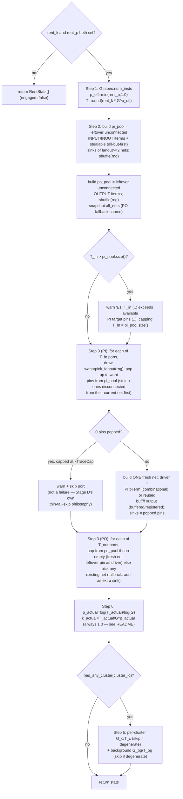

**Step 3 pin-type dispatch.** PI always builds a fresh net from pool
material; PO either builds a fresh net (leftover pin) or augments an
existing one (fallback) — either way, an existing net's *driver* is never
touched by either path:

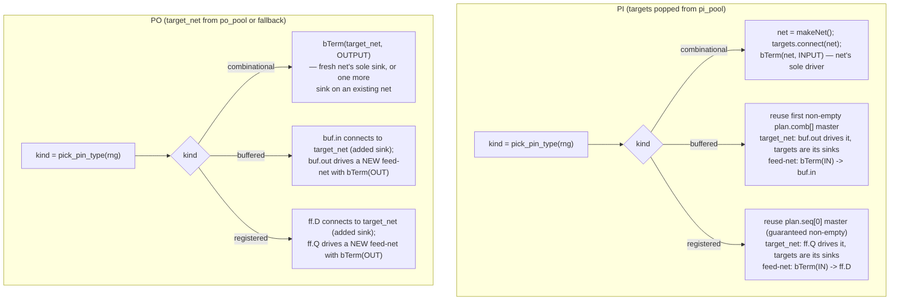

`firstOutputIterm`/`firstDataInputIterm` locate a reused master's driver pin
and its first non-clock data input by IoType/SigType — never by pin name —
matching the rest of this file's low-level `dbITerm` manipulation style
(`isClockPinName` catches libraries like Nangate45 that tag `CK` `USE
SIGNAL`, same fallback `isSequentialMaster` already relies on). New
instances/nets continue the existing `u<i>`/`n<i>` naming sequences from the
internal counts — planes (via `RentStats`, not names) are what distinguish a
boundary cell from an internal one.

## Engine-level flow: spec → block → hypergraph

End to end, netlistgen turns a declarative spec into a `dbBlock` (synthetic or
LEF-backed) that the downstream `Hypergraph` consumes. netlistgen writes no
attribute planes.

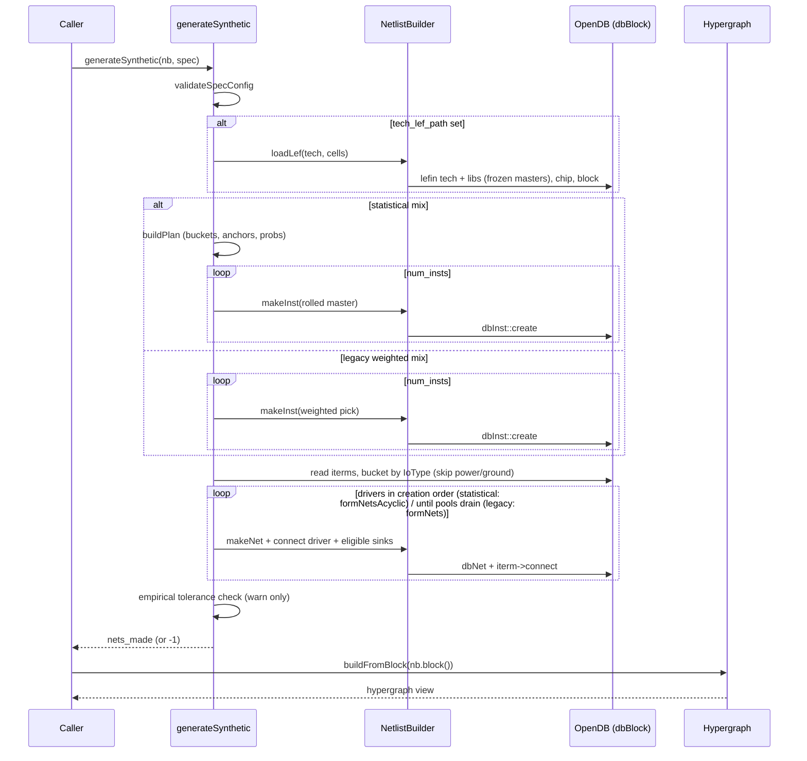

## `netlist_validation.cpp` — well-formedness check (Stage C; bTerm-aware since Stage E1; instance check added alongside Stage D's repair pass)

`validateNetlist(block)` walks every `dbNet` and tallies its connected
terminals by IoType (power/ground skipped by `dbSigType`) — `dbITerm`s via
`tallyITerms`, and, since Stage E1, `dbBTerm`s via `tallyBTerms` (a `dbBTerm`
with IoType `INPUT` counts as a driver — a primary input supplies the net
from outside; `OUTPUT`/`INOUT` counts as a sink) — both feeding one shared
`NetTally` before the verdict. This is a distinct guarantee from Stage D's
loop-freedom: a net can be perfectly well-formed and still sit on a
combinational cycle. Folding bTerms in here (rather than a parallel rule) is
exactly why Stage E1's primary-input realization *replaces* a selected net's
existing driver instead of adding the PI bTerm alongside it — see
`netlist_validation.h` and the netlistgen README's "Primary I/O generation
(Stage E1)" section.

Once every net passes, a second loop (`instanceHasConnectedOutput`) walks
every `dbInst` and confirms at least one of its signal `OUTPUT` iterms has a
non-null net — a check the net-centric tallies above cannot express, since
they never see a driver pin that was never connected to any net at all.
This is the hard gate `formNetsAcyclic`'s no-dangling-instance repair pass
(see its own section above) exists to satisfy.

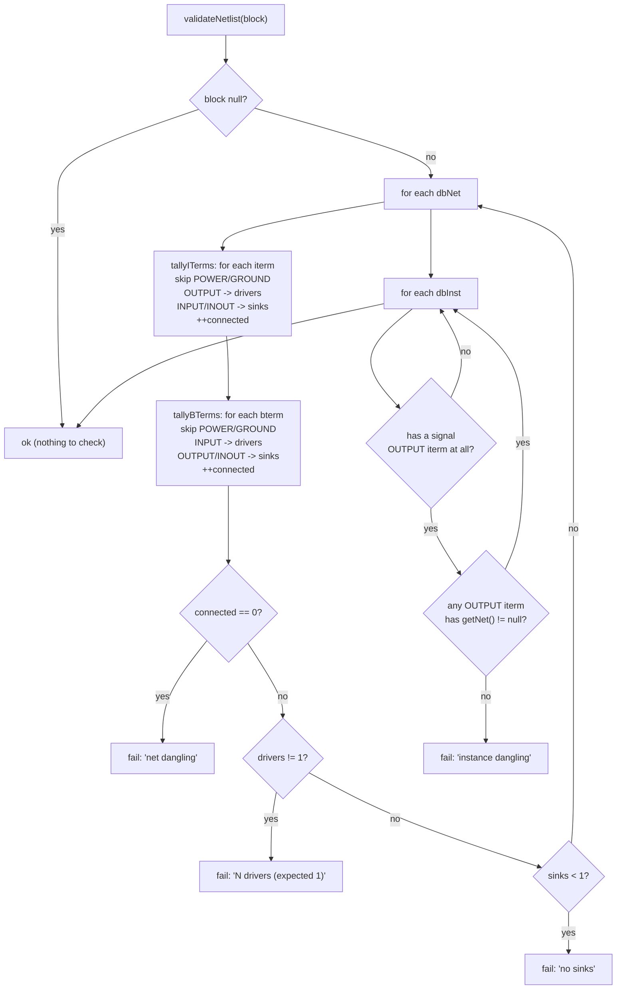

## `netlist_writers.cpp` — DEF / `.odb` output (Stage C)

Two thin wrappers, callable independently of the CLI. `writeDef` drives
`odb::DefOut` at version 5.8 — `netlistgen` never touches this file for
Stage E1's `dbBTerm`s at all: `DefOut::writeBlock` is a generic ODB
serializer that already emits a correct `PINS` section for whatever
`dbBTerm`s exist on the block (verified manually against Stage E1 output; no
pin placement/geometry, since these bTerms carry none); it supplies a local
`utl::Logger` when the caller passes none. `writeOdb` wraps
`dbDatabase::write`, which takes a `std::ostream`, in a checked `ofstream`.
(Synthetic-tech DBUs are set to 2000/µm in `ensureSyntheticTech` so DefOut's
def-units ÷ dbu-per-micron scaling is well-defined; LEF mode inherits real
units from the tech LEF.)

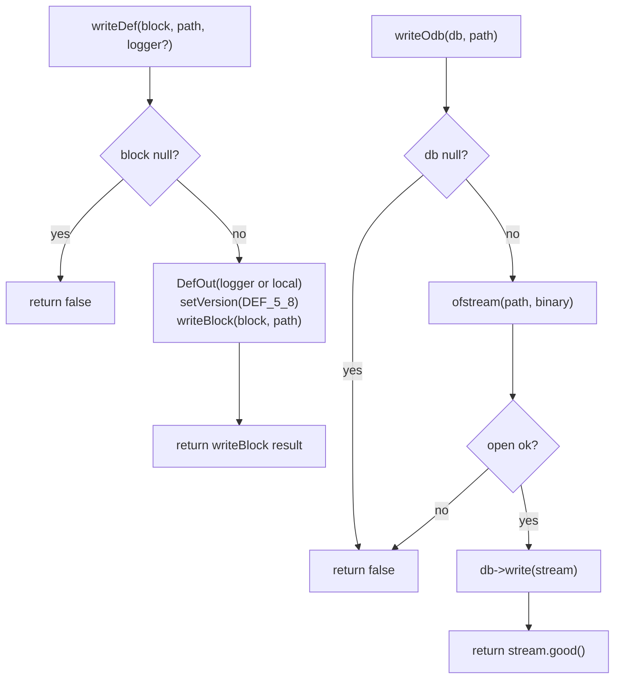

## `cli_config.cpp` / `netlistgen_cli.cpp` — the CLI (Stage C)

JSON is confined to the CLI layer — it never reaches `NetlistBuilder` /
`generateSynthetic`. `parseCliConfig` deserialises the JSON into a
`SyntheticNetlistSpec` plus CLI-only output paths, enforcing CLI-level rules
(well-formed JSON, required `instance_count`, ≥1 output path); spec-level rules
stay with `validateSpecConfig` at generation time. `runCliFromFile` is the one
pipeline: create a shared `utl::Logger` (verbosity from the `-verbosity` flag
via `applyVerbosity`) → parse → `generateSynthetic` (builder shares the logger)
→ `estimateDieArea` → `validateAndWrite` → `reportDesignSummary` (final
default-visible statistics block: cell counts comb/seq, combinational
pin-count histogram, net count, average fanout per net and a fanout histogram —
fanout meaning load pins, driver excluded, with `10-50`/`>50` bucketed) →
log done. Each step is an
`info` phase marker; `-verbosity` surfaces the library's `debugPrint` detail through
the same logger. `validateAndWrite` gates output on `validateNetlist` (a
malformed block writes **nothing**, fail-fast) and then creates each requested
output path's parent directory (with `create_directories`) if it is missing,
before writing; only a directory that genuinely cannot be created fails, with
no partial output. `main()` in `netlistgen_cli.cpp`
parses the positional config path and the optional `-verbosity <level>` flag,
then calls `runCliFromFile` inside a top-level `try/catch` backstop (see
"Error handling" in `CLAUDE.md`).

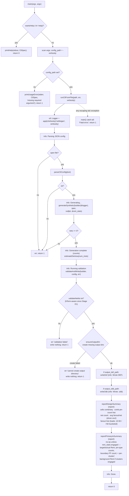

### CLI parse mapping

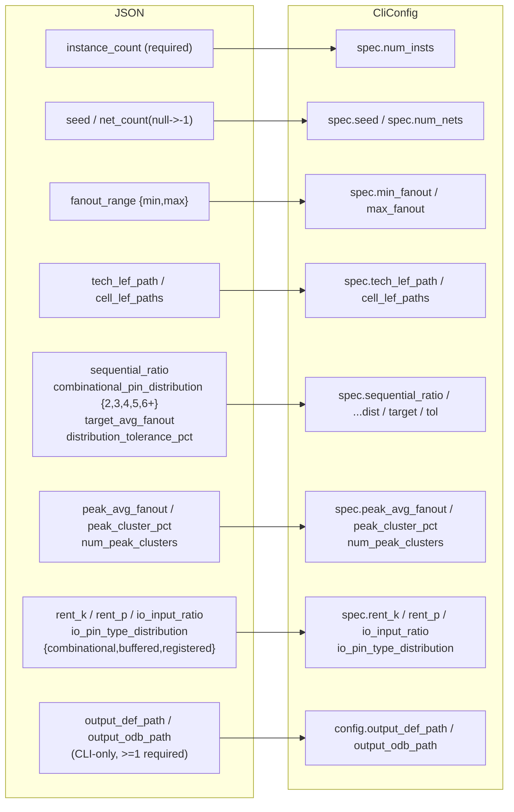
