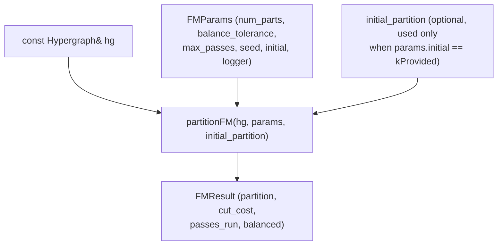
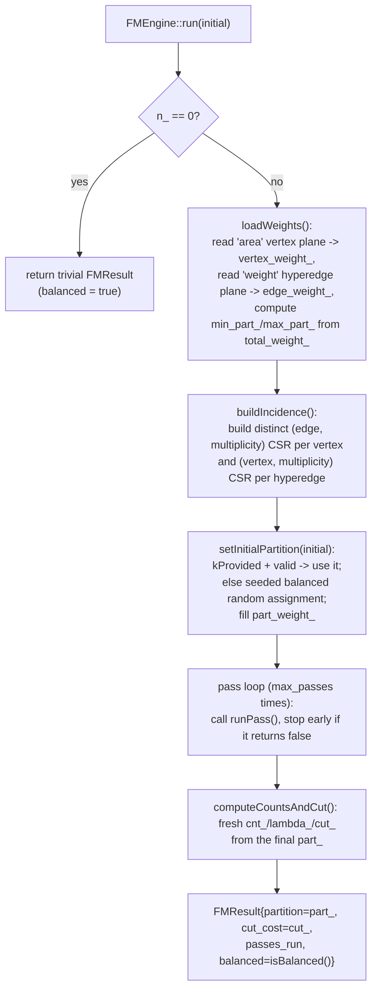
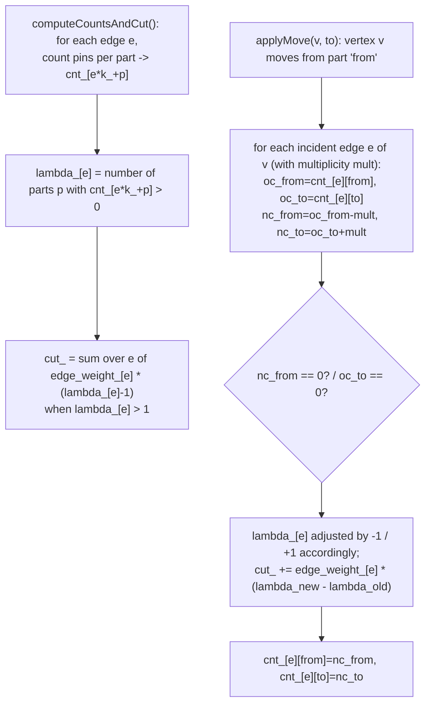
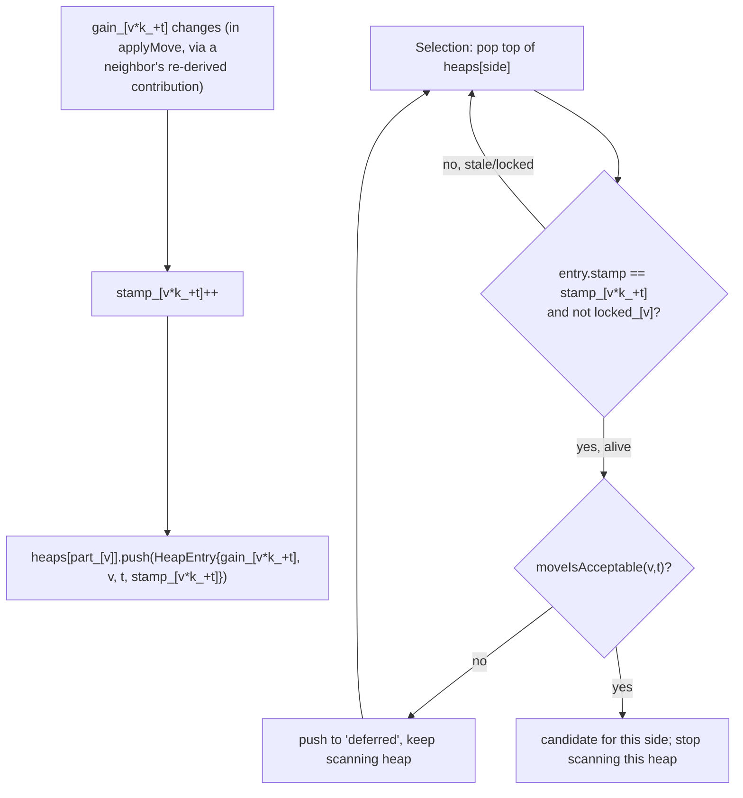
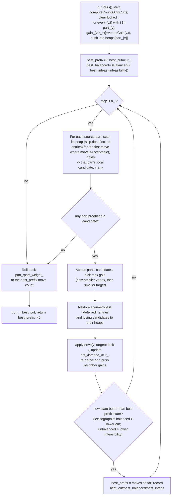
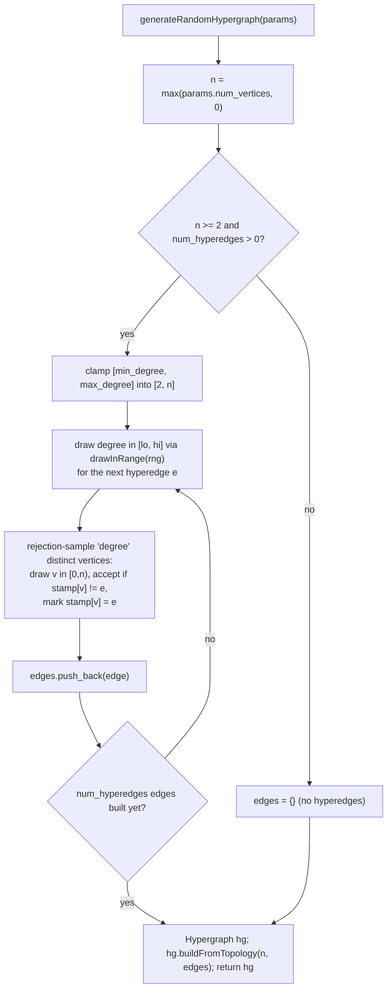
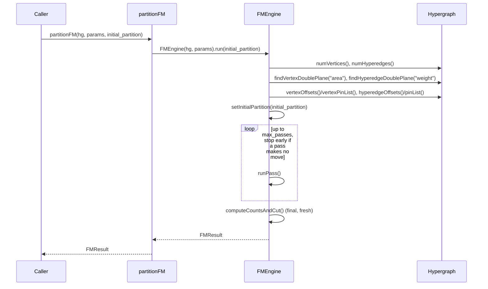
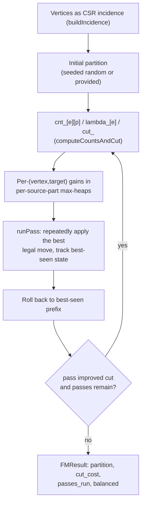

# Flow: Partitioning Engine

The partitioning engine (`src/engines/partitioning/`) is a flat, no-coarsening
K-way Fiduccia–Mattheyses (FM) partitioner: `partitionFM()` splits an
`eda::Hypergraph`'s vertices into `num_parts` parts to minimize the weighted
**connectivity-1** objective — for hyperedge `e` with λ(e) distinct parts
touching it, `cut_cost = Σ weight(e) × (λ(e) − 1)` — subject to a per-part
vertex-weight balance window. For `num_parts == 2` this collapses to the
Stage 1 weighted spanning cut; the same code path (not a separate
implementation) handles both, which is why there is one FM source file, not
two. `random_hypergraph.h/.cpp` is a companion test-input generator, unrelated
to the FM algorithm itself. This document covers Stages 1–2 as they exist
today (flat FM only; no multilevel coarsening).

## `fm_partitioner.h` — API contract

Declares the pure-library surface: `FMParams` (K, `balance_tolerance`,
`max_passes`, `seed`, `initial` ∈ {`kRandom`, `kProvided`}, optional
`logger`), `FMResult` (`partition`, `cut_cost`, `passes_run`, `balanced`), and
the entry point `partitionFM(hg, params, initial_partition)`. No logic lives
here — it exists so later stages (multilevel driver, CLI/Python/GUI) can call
this API without depending on `fm_partitioner.cpp`'s internals.

## `fm_partitioner.cpp` — FM engine implementation

All logic lives in the anonymous-namespace class `FMEngine`, constructed with
`(hg, params)` and driven by `FMEngine::run()`.

### Setup: `run()` entry sequence

`run()` reads `hg.numVertices()`/`numHyperedges()` into `n_`/`m_`, then calls
four setup steps before the pass loop. When a `logger` is attached, `run()`
and `runPass()` emit **debug-gated** trace (`debugPrint`, group `"fm"`): run
setup + convergence + final at level 1, per-pass cut deltas at level 1, and
per-move gains at level 3 (capped). Nothing prints at verbosity 0, preserving
the pure-library "nothing prints" contract — see the README's verbosity note.

`buildIncidence()` deserves its own note: the vertex-major CSR
(`vertexOffsets()`/`vertexPinList()`) is already sorted per vertex by the
`Hypergraph` build guarantee, so a single run-length pass collapses repeated
`(vertex, edge)` pins into `(edge, multiplicity)` entries (`v_edge_`,
`v_mult_`). The hyperedge-major CSR (`hyperedgeOffsets()`/`pinList()`) follows
`dbITerm` order, not sorted, so each edge's member list is copied and sorted
before the same run-length collapse produces `e_vert_`/`e_mult_`. Sorting also
fixes a deterministic per-edge member order used later when re-deriving
neighbor gains.

### Connectivity-1 objective: `cnt_`/`lambda_` and incremental updates

The core state is one pin count per (hyperedge, part) — `cnt_[e*k_+p]` — and
the derived connectivity `lambda_[e]` (number of parts with `cnt_[e*k_+p] >
0`). `computeCountsAndCut()` builds both from scratch by scanning each edge's
pins once. `applyMove()` (called when a vertex actually moves) touches only
the `from`/`to` slots of each incident edge and adjusts `lambda_`/`cut_` in
O(1) from the before/after slot values — no recount.

Gain values are derived from these same counts. With `n_p(e)` = pins of `e` in
part `p` and vertex `u` holding `mult(u,e)` pins of `e`, `vertexGain(v, to)`
sums, over `v`'s distinct incident edges, `edge_weight_[e]` once if moving `v`
empties its source part (`cnt_[e][from] == mult`) and subtracts it once if the
move newly occupies the target (`cnt_[e][to] == 0`). This one formula replaces
the textbook T(e)==0/1 case split, and is valid for any K and any pin
multiplicity per vertex.

### Gain data structure: heap with lazy deletion

Because hyperedge weights are doubles, gains cannot use an integer bucket
list. Instead there is one max-heap (`GainHeap`, a `std::priority_queue` of
`HeapEntry` ordered by `EntryOrder`) per **source part**, holding one entry
per `(vertex, target part)` candidate move. A vertex in part `p` has `K-1`
live candidates, all in heap `p`. `gain_[v*k_+t]` and `stamp_[v*k_+t]` hold the
current true gain and a version stamp; every time a gain changes, `applyMove`
bumps the stamp and pushes a fresh `HeapEntry` — older heap entries for that
`(v,t)` become stale and are dropped, not erased, when popped.

`EntryOrder` breaks gain ties toward the smaller vertex index, then the
smaller target part, so the final selection across all heaps (see below) is a
pure function of the gain values — required for the determinism contract.

### FM pass: `runPass()` candidate selection and rollback

Each pass rebuilds counts, gains, and heaps from scratch (locks cleared), then
repeats "pick best legal move, apply it, track best-seen state" until no
vertex can move.

Moves are applied even when the chosen gain is negative — classic FM — and
`best_prefix` rollback at pass end discards the tail of moves after the last
improvement, which is how a pass escapes local minima. `moveIsAcceptable()`
accepts any move that keeps both endpoints' part weights inside
`[min_part_, max_part_]`; if the current state is already infeasible (only
reachable from a bad `kProvided` initial partition), it additionally accepts
moves that strictly reduce total `infeasibility()`, letting FM walk back to
feasibility instead of freezing.

## `random_hypergraph.h` / `random_hypergraph.cpp` — test input generator

`generateRandomHypergraph(params)` builds a dbBlock-free `Hypergraph` via
`Hypergraph::buildFromTopology`, independent of the FM algorithm — it exists
to give engine tests controlled-size, controlled-degree inputs without
LEF/DEF or `netlistgen`'s pin bookkeeping.

All randomness is raw `std::mt19937` output mapped by modulo (`drawInRange`),
never `std::uniform_int_distribution`, so a given `(params, seed)` produces a
bit-identical hypergraph on every platform — the same determinism discipline
`fm_partitioner.cpp`'s `drawBelow` follows for the FM initial partition.

## Engine-level: end-to-end algorithm

For `num_parts == 2`, `lambda_[e]` is only ever 1 or 2, `cut_` reduces exactly
to the Stage 1 weighted spanning cut, and every floating-point operation above
runs in the same order as the Stage 1 implementation — this is what makes the
K = 2 path reproduce Stage 1 results bit-for-bit.
