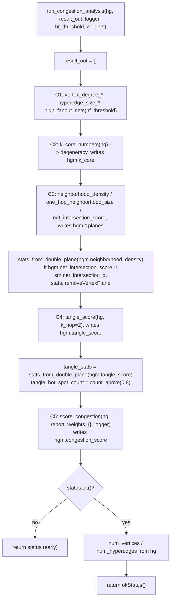
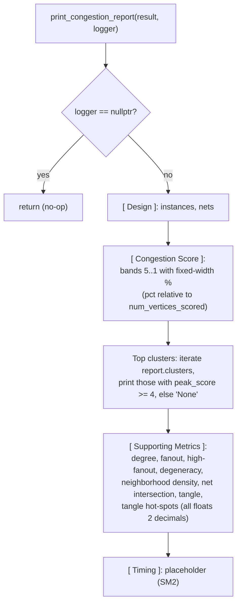
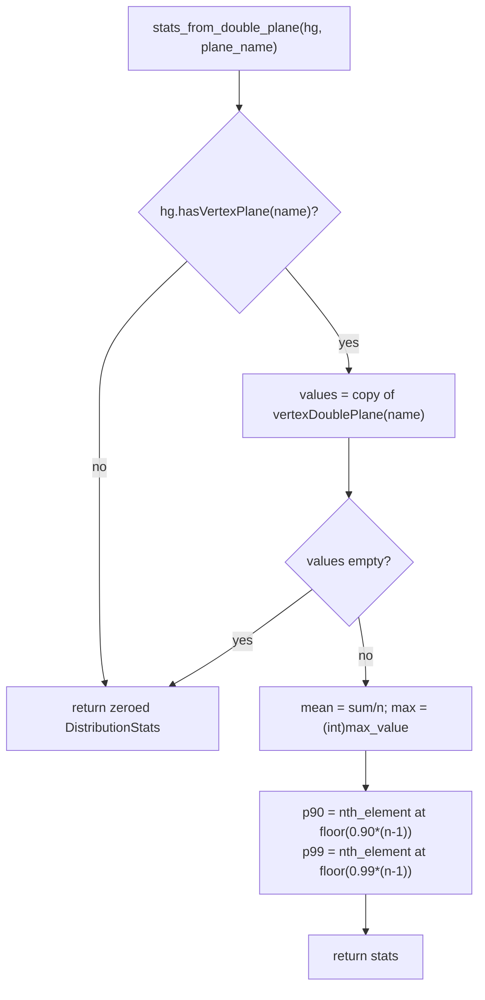
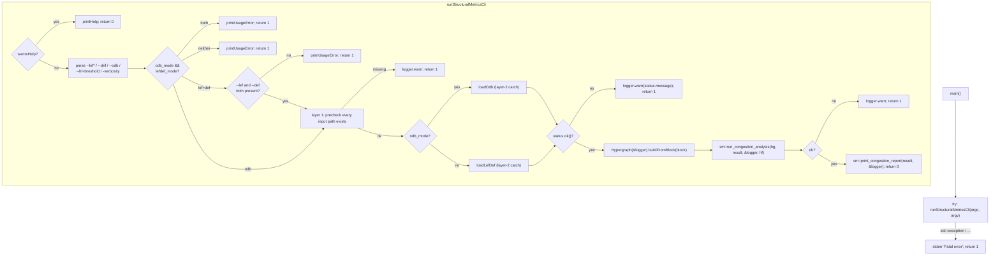
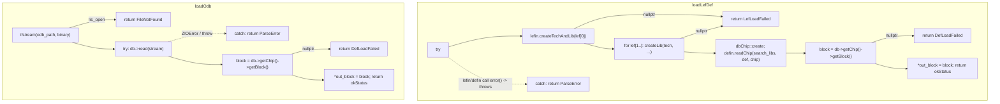
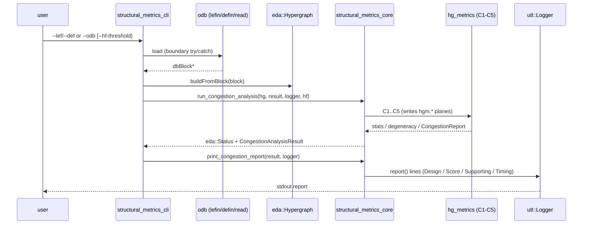

# structural_metrics — algorithmic flow

The `structural_metrics` engine drives the `hg_metrics` congestion group (C1–C5)
over an `eda::Hypergraph` and renders a report. Two source files: the core
library (`structural_metrics.cpp`) and the thin CLI (`structural_metrics_cli.cpp`).
Diagrams below name the real functions/types so they can be cross-checked
against the source.

## `structural_metrics.cpp` — core library

`run_congestion_analysis` calls the `hg_metrics` kernels in a fixed C1→C5 order,
each writing its `hgm.*` plane, and collects the summary into a
`CongestionAnalysisResult`. `stats_from_double_plane` is the file-scope helper
that computes a `hgm::DistributionStats` over a written double plane (needed
because C3/C4 planes are read back for their distributions, and the int
net-intersection plane is lifted to a temporary `sm.net_intersection_d` double
plane, summarised, then removed). `print_congestion_report` renders the result.

### `stats_from_double_plane` control flow

## `structural_metrics_cli.cpp` — CLI

`main()` is a thin layer-3 `try/catch` over `runStructuralMetricsCli`, which
parses args (via `eda::CliSpec`), validates the input mode, prechecks files
(layer 1), loads through a boundary `try/catch` (layer 2), builds the
hypergraph, calls the core, and prints the report.

### Loaders (layer-2 boundary catch)

## End-to-end (CLI → core → report)

