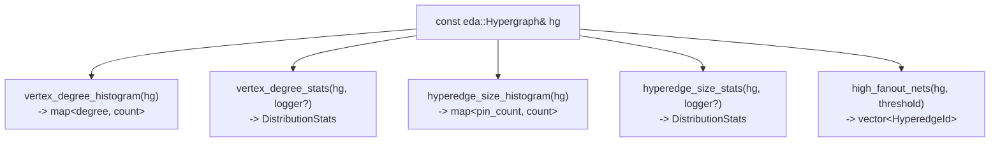
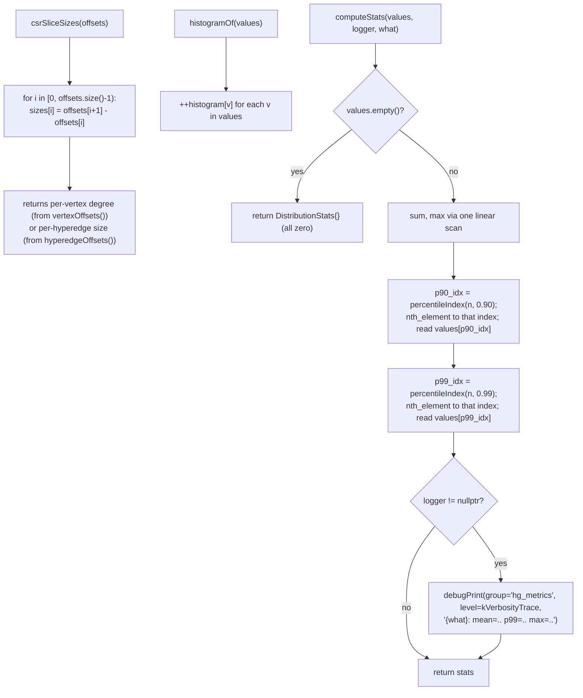
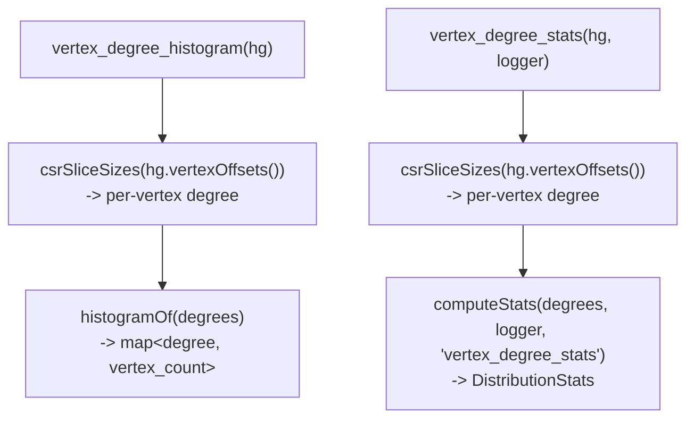
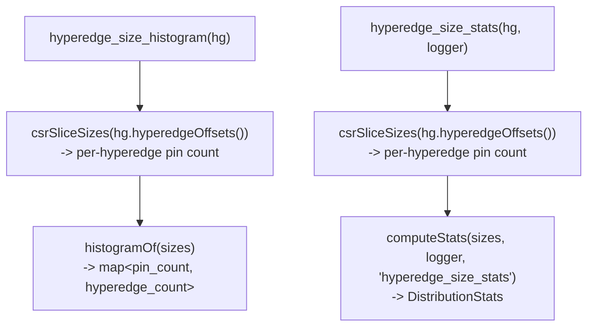
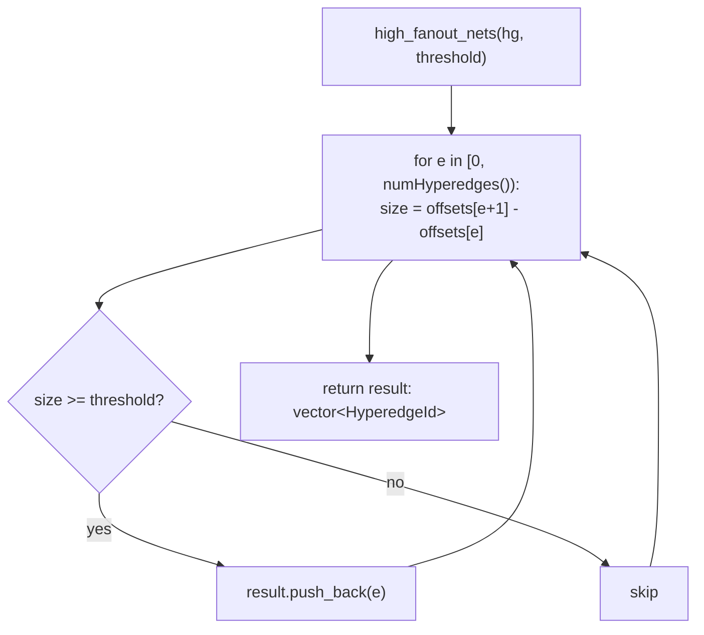
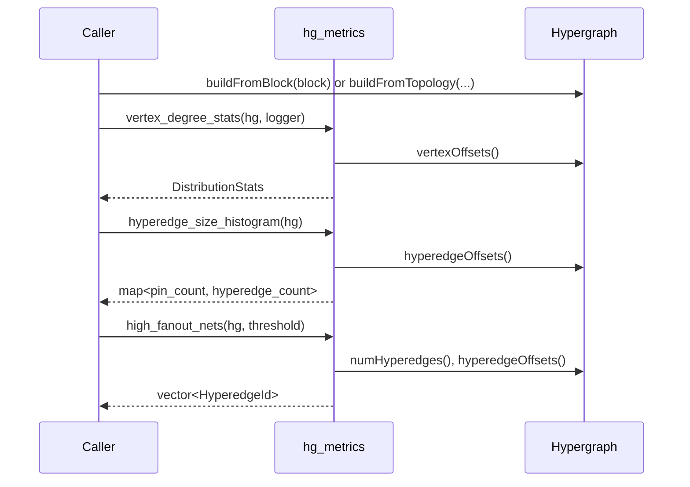

# Flow: hg_metrics

`src/hg_metrics/` computes read-only metrics over an `eda::Hypergraph`'s CSR
topology. This brief (Spike C1) implements the congestion metric group —
vertex degree distribution, hyperedge size (fanout) distribution, and
high-fanout net identification — plus a stub `timing_metrics.h/.cpp` so the
build is complete for a later brief. Nothing here mutates the hypergraph or
writes attribute planes.

## `congestion_metrics.h` — API contract

Declares `DistributionStats` (`mean`, `p90`, `p99`, `max`; shared with
`timing_metrics.h`), the `HyperedgeId` alias (a local hyperedge index — this
module has no dedicated stable id type, only the snapshot-local CSR index),
and six functions: `vertex_degree_histogram`/`vertex_degree_stats`,
`hyperedge_size_histogram`/`hyperedge_size_stats`, and `high_fanout_nets`.

## `congestion_metrics.cpp` — implementation

Three private helpers do the real work; the six public functions are thin
wrappers over them.

`percentileIndex(n, p)` is the nearest-rank position in a 0-indexed sorted
array of size `n`: `floor(p * (n - 1))`, clamped into `[0, n - 1]`.

### Function group: vertex degree

### Function group: hyperedge size (fanout)

### Function group: high-fanout nets

## `timing_metrics.h` / `timing_metrics.cpp` — stub

`timing_metrics.h` only pulls in `congestion_metrics.h` for the shared
`DistributionStats` type and declares no functions yet (`TODO` marker for a
later spike brief, T0–T4). `timing_metrics.cpp` includes the header and
compiles to an empty translation unit. Both exist purely so the CMake
target and build are complete from day one.

## Module-level: how a caller uses this

The hypergraph is never mutated and no attribute planes are read or
written — every arrow above is a read of the existing CSR arrays.
