# Flow: hg_metrics

`src/hg_metrics/` computes metrics over an `eda::Hypergraph`'s CSR topology.
Spike C1 implements the congestion metric group — vertex degree distribution,
hyperedge size (fanout) distribution, and high-fanout net identification —
all read-only; Spike C2 adds `k_core_numbers`, which reads the same CSR
arrays but writes a structural-centrality result into the `"hgm.k_core"`
attribute plane. Spike C3 adds three label-weighted neighborhood metrics —
`neighborhood_density` (a NESS propagation BFS), `one_hop_neighborhood_size`,
and `net_intersection_score` — each reading the CSR arrays and writing its own
per-vertex `"hgm."` plane. A stub `timing_metrics.h/.cpp` keeps the build
complete for a later brief.

## `congestion_metrics.h` — API contract

Declares `DistributionStats` (`mean`, `p90`, `p99`, `max`; shared with
`timing_metrics.h`), the `HyperedgeId` alias (a local hyperedge index — this
module has no dedicated stable id type, only the snapshot-local CSR index),
the five read-only distribution functions —
`vertex_degree_histogram`/`vertex_degree_stats`,
`hyperedge_size_histogram`/`hyperedge_size_stats`, `high_fanout_nets` — and
(Spike C2) `k_core_numbers` and (Spike C3) `neighborhood_density`,
`one_hop_neighborhood_size`, `net_intersection_score` — the plane-writing
functions that take the hypergraph by non-const reference.

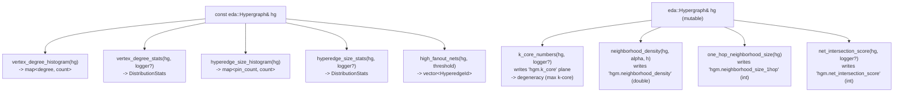

## `congestion_metrics.cpp` — implementation

Three private helpers do the real work; the six public functions are thin
wrappers over them.

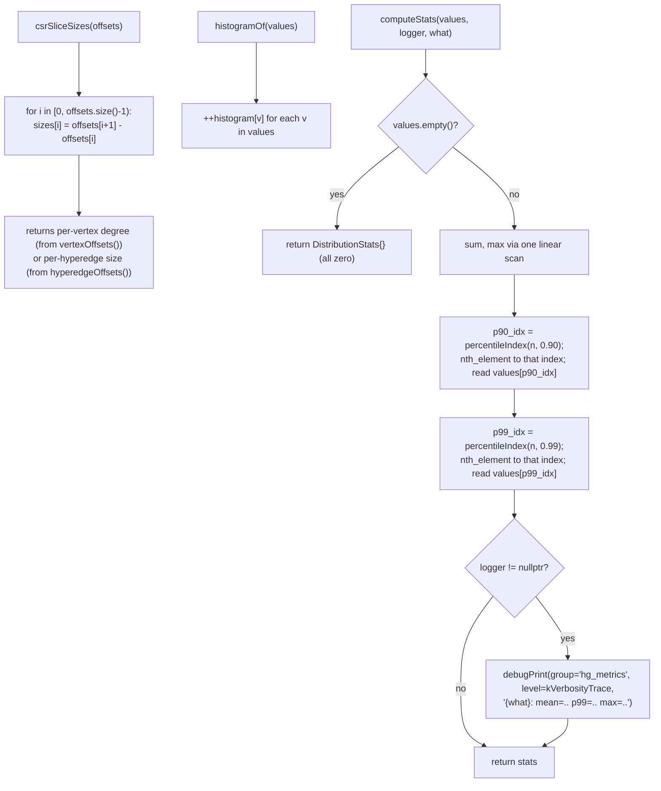

`percentileIndex(n, p)` is the nearest-rank position in a 0-indexed sorted
array of size `n`: `floor(p * (n - 1))`, clamped into `[0, n - 1]`.

### Function group: vertex degree

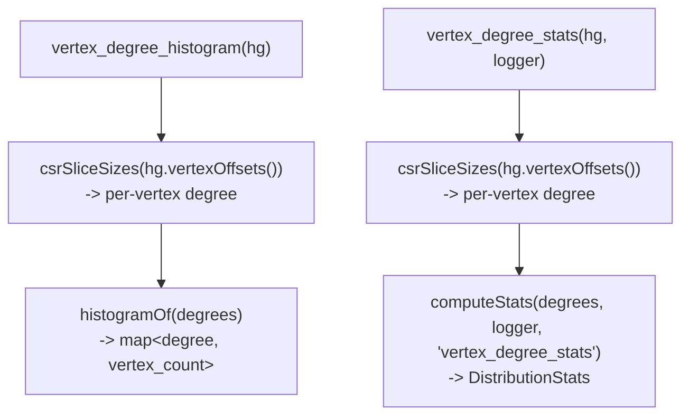

### Function group: hyperedge size (fanout)

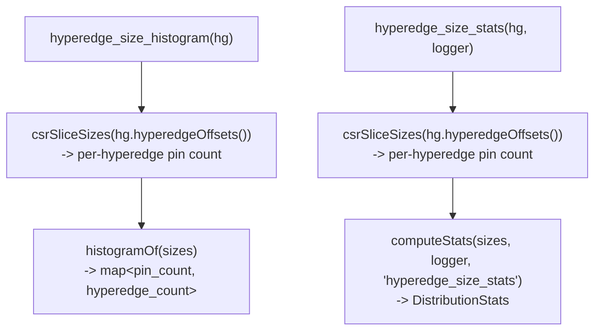

### Function group: high-fanout nets

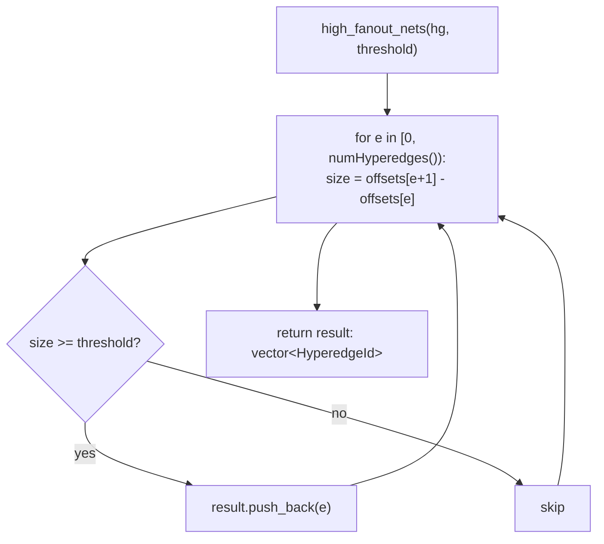

### Function group: k-core decomposition

`k_core_numbers(hg, logger?)` peels the hypergraph in non-decreasing
effective-degree order and writes each vertex's core number into the
`"hgm.k_core"` int plane. Effective degree counts a vertex's incident
hyperedges that still have >= 2 active members; a hyperedge stops
contributing degree the instant it drops to a single survivor. The
degeneracy (max core number) is returned. The bucket queue
(`std::vector<std::list<int>>` indexed by degree, one `node[v]` iterator per
vertex) gives O(1) degree-update removal, so the whole peel is O(n + pins).

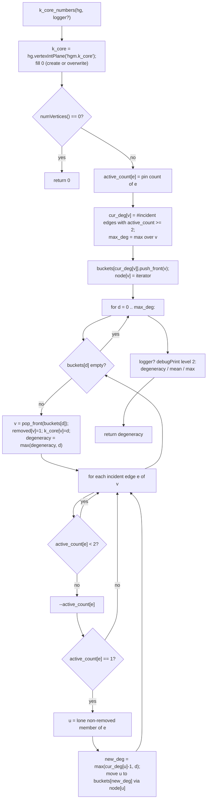

The `max(cur_deg[u]-1, d)` clamp is the degeneracy-ordering invariant:
everything with core number below the current level `d` is already peeled, so
a survivor whose remaining degree dips under `d` still takes core number `d`.
`removed[]`, `cur_deg[]`, `active_count[]`, and the buckets are all local to
the call — the hypergraph's CSR structure is never mutated, only the output
plane is written.

### Function group: NESS neighborhood density (Spike C3)

Adjacency here is the hypergraph relation — two vertices are one hop apart iff
they share a hyperedge, so a hop expands `v -> every member of every
hyperedge incident to v` (`vertexPinList()` then `pinList()`). `degree[v]` is
the C1 incident-hyperedge count (`vertexOffsets()` slice length), precomputed
once by `vertexDegrees` and reused as the NESS label weight.

`propagate_neighborhood` (static, not in the header) is the shared BFS core of
`neighborhood_density`. It runs one BFS per source `u`, accumulating decayed
neighbor degree into `out[u]`. A monotonic `stamp[w] = u` marks "visited by
source u at its shortest distance", so no per-source `O(n)` clear of the
marker array is needed; `dist[w]` carries each visited vertex's BFS depth.

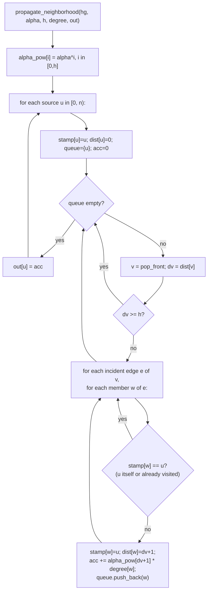

`neighborhood_density(hg, alpha, h)` writes/zeroes the
`"hgm.neighborhood_density"` double plane, short-circuits to all-zero when
`numVertices()==0` or `h<=0` (and `alpha==0` naturally zeroes every term via
`alpha_pow`), then calls `propagate_neighborhood`.

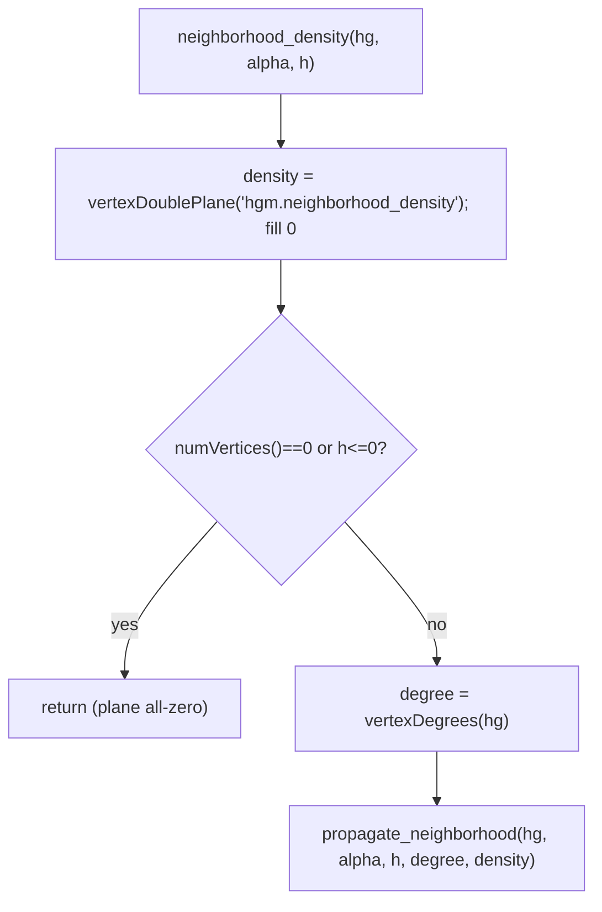

`one_hop_neighborhood_size(hg)` is a single CSR pass, no BFS: for each `u`
walk its incident edges and their members, epoch-stamp each distinct neighbor
`w != u` once, and write the count to the `"hgm.neighborhood_size_1hop"` int
plane.

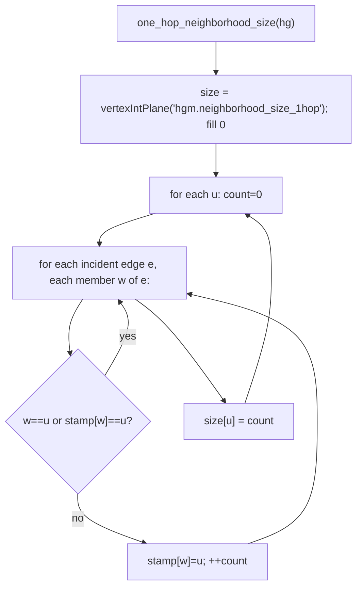

`net_intersection_score(hg, logger?)` sums, over each vertex `u`'s unordered
pairs of incident hyperedges `(e1,e2)`, `|V(e1) ∩ V(e2)| - 1` (discounting
`u`). A monotonic `epoch` stamps `e1`'s members, then `e2`'s members are
counted against that stamp — no per-pair set allocation or clear. A degree
above `kHighDegreeWarnThreshold` (64) triggers a `warn` (id 130) when a logger
is attached, since the inner pair loop is quadratic in degree.

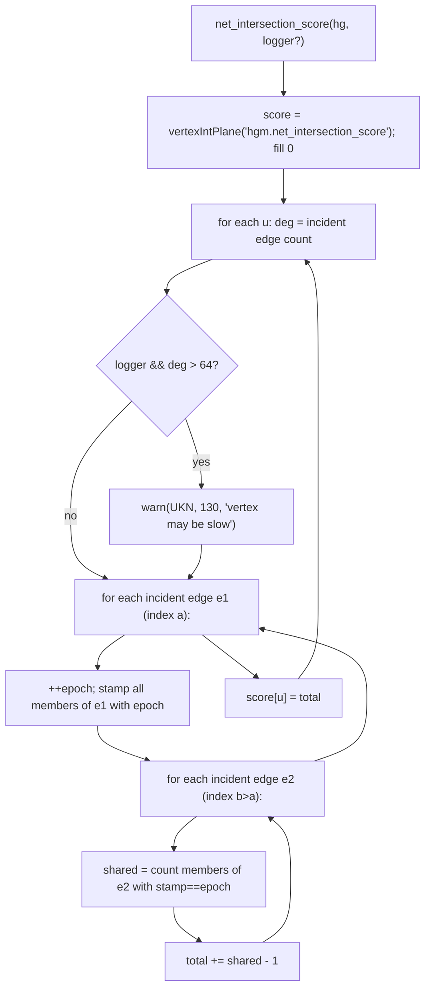

## `timing_metrics.h` / `timing_metrics.cpp` — stub

`timing_metrics.h` only pulls in `congestion_metrics.h` for the shared
`DistributionStats` type and declares no functions yet (`TODO` marker for a
later spike brief, T0–T4). `timing_metrics.cpp` includes the header and
compiles to an empty translation unit. Both exist purely so the CMake
target and build are complete from day one.

## Module-level: how a caller uses this

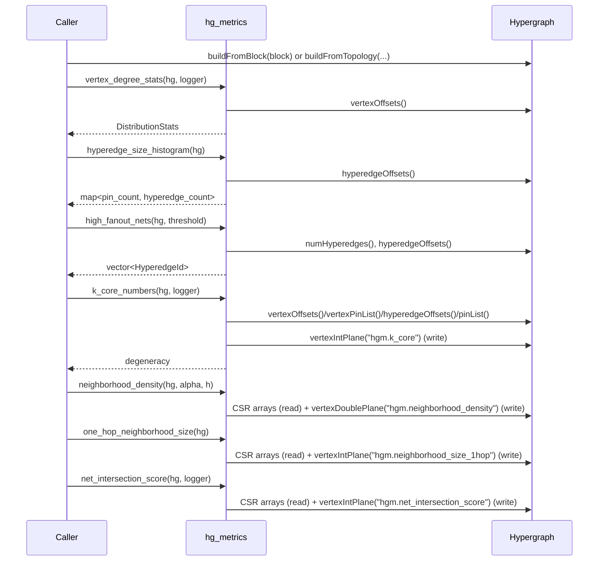

The distribution functions never mutate the hypergraph — every arrow for
them is a read of the existing CSR arrays. `k_core_numbers` and the three C3
neighborhood functions are the exceptions: each reads the same CSR arrays but
*writes* one `"hgm."` attribute plane as its only side effect; the CSR
topology is untouched.
