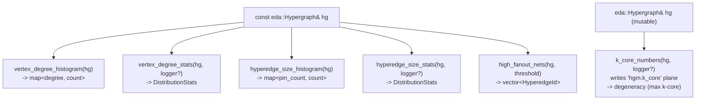
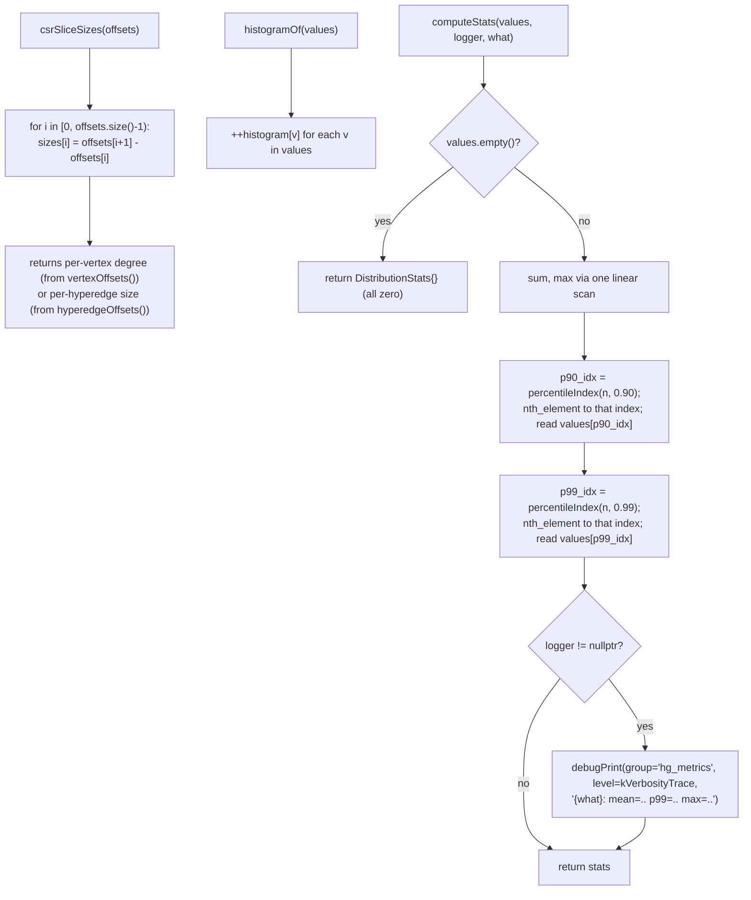
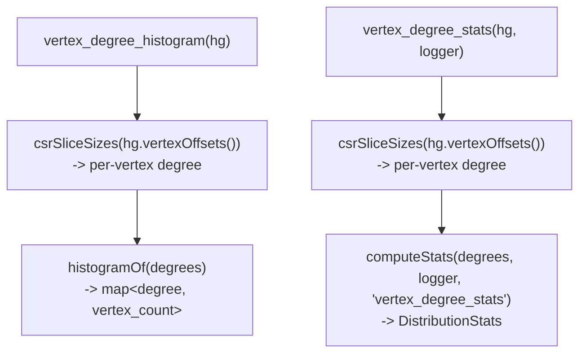
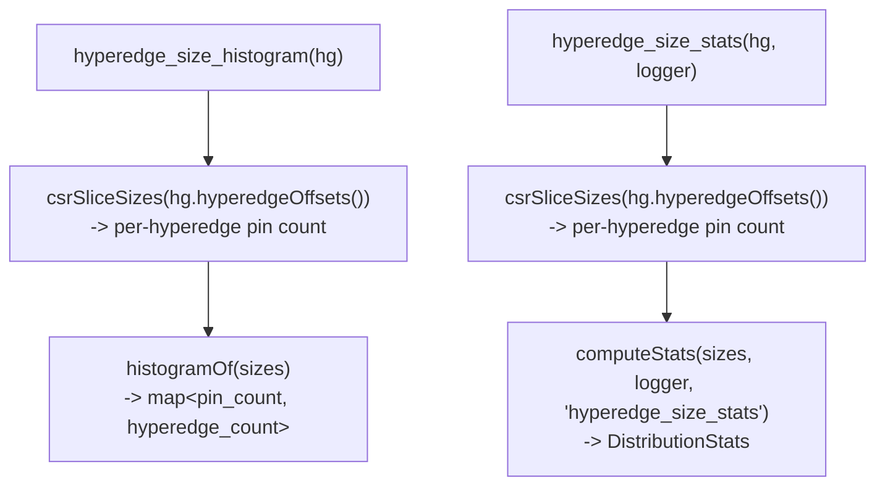
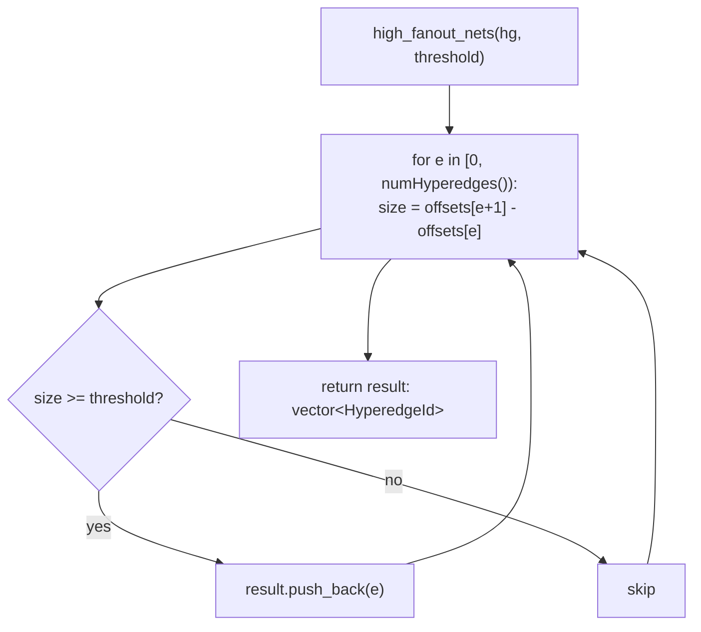
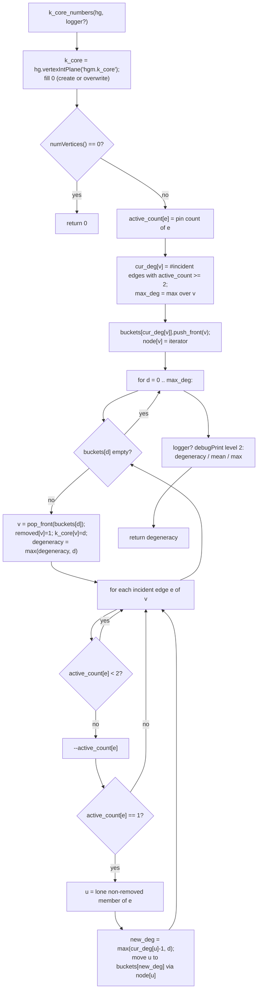
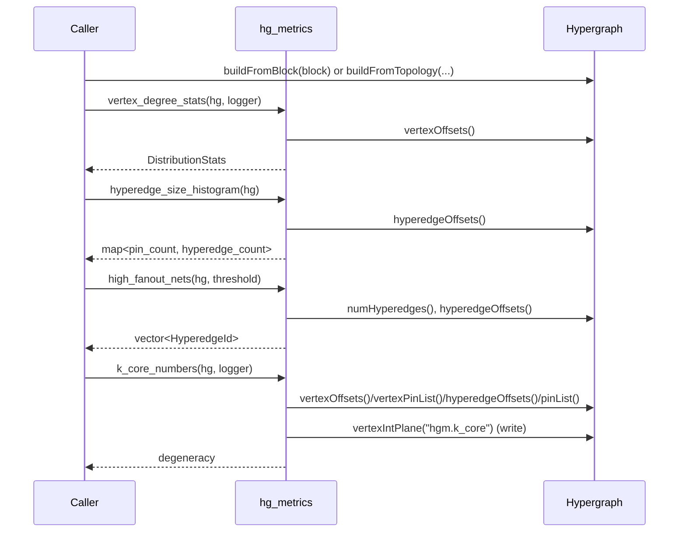

# Flow: hg_metrics

`src/hg_metrics/` computes metrics over an `eda::Hypergraph`'s CSR topology.
Spike C1 implements the congestion metric group — vertex degree distribution,
hyperedge size (fanout) distribution, and high-fanout net identification —
all read-only; Spike C2 adds `k_core_numbers`, which reads the same CSR
arrays but writes a structural-centrality result into the `"hgm.k_core"`
attribute plane. A stub `timing_metrics.h/.cpp` keeps the build complete for
a later brief.

## `congestion_metrics.h` — API contract

Declares `DistributionStats` (`mean`, `p90`, `p99`, `max`; shared with
`timing_metrics.h`), the `HyperedgeId` alias (a local hyperedge index — this
module has no dedicated stable id type, only the snapshot-local CSR index),
the five read-only distribution functions —
`vertex_degree_histogram`/`vertex_degree_stats`,
`hyperedge_size_histogram`/`hyperedge_size_stats`, `high_fanout_nets` — and
(Spike C2) `k_core_numbers`, the one function here that takes the hypergraph
by non-const reference because it writes the `"hgm.k_core"` int plane.

## `congestion_metrics.cpp` — implementation

Three private helpers do the real work; the six public functions are thin
wrappers over them.

`percentileIndex(n, p)` is the nearest-rank position in a 0-indexed sorted
array of size `n`: `floor(p * (n - 1))`, clamped into `[0, n - 1]`.

### Function group: vertex degree

### Function group: hyperedge size (fanout)

### Function group: high-fanout nets

### Function group: k-core decomposition

`k_core_numbers(hg, logger?)` peels the hypergraph in non-decreasing
effective-degree order and writes each vertex's core number into the
`"hgm.k_core"` int plane. Effective degree counts a vertex's incident
hyperedges that still have >= 2 active members; a hyperedge stops
contributing degree the instant it drops to a single survivor. The
degeneracy (max core number) is returned. The bucket queue
(`std::vector<std::list<int>>` indexed by degree, one `node[v]` iterator per
vertex) gives O(1) degree-update removal, so the whole peel is O(n + pins).

The `max(cur_deg[u]-1, d)` clamp is the degeneracy-ordering invariant:
everything with core number below the current level `d` is already peeled, so
a survivor whose remaining degree dips under `d` still takes core number `d`.
`removed[]`, `cur_deg[]`, `active_count[]`, and the buckets are all local to
the call — the hypergraph's CSR structure is never mutated, only the output
plane is written.

## `timing_metrics.h` / `timing_metrics.cpp` — stub

`timing_metrics.h` only pulls in `congestion_metrics.h` for the shared
`DistributionStats` type and declares no functions yet (`TODO` marker for a
later spike brief, T0–T4). `timing_metrics.cpp` includes the header and
compiles to an empty translation unit. Both exist purely so the CMake
target and build are complete from day one.

## Module-level: how a caller uses this

The distribution functions never mutate the hypergraph — every arrow for
them is a read of the existing CSR arrays. `k_core_numbers` is the one
exception: it reads the same CSR arrays but *writes* the `"hgm.k_core"` int
attribute plane (its only side effect; the CSR topology is untouched).
